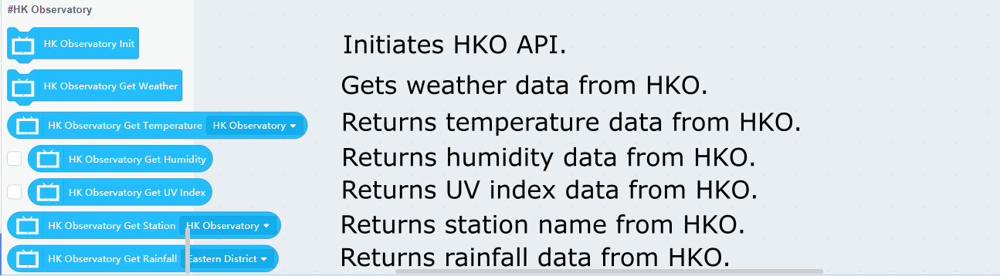
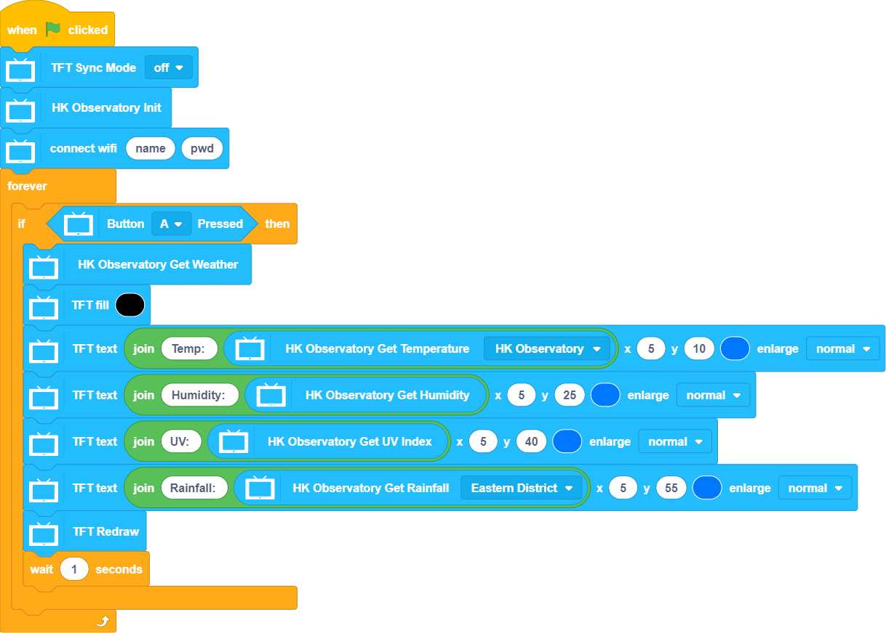

# Programming with KittenBlock: HK Observatory

It is easy to get the open data from HK Observatory using the provided blocks in KittenBlock.(Internet Connection Required)

## HKO API Blocks

### Sample Program: Getting the Current Weather

