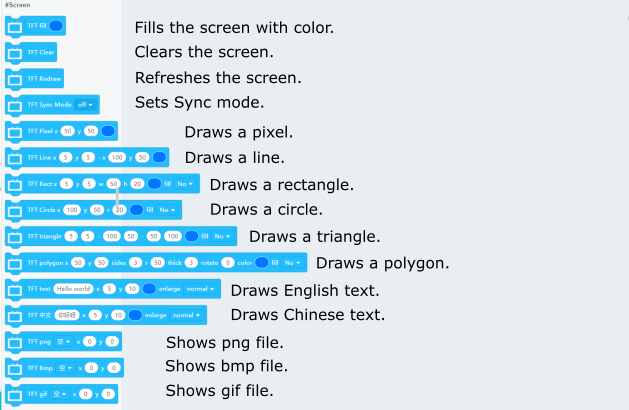
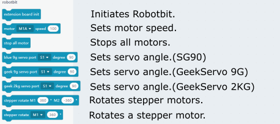
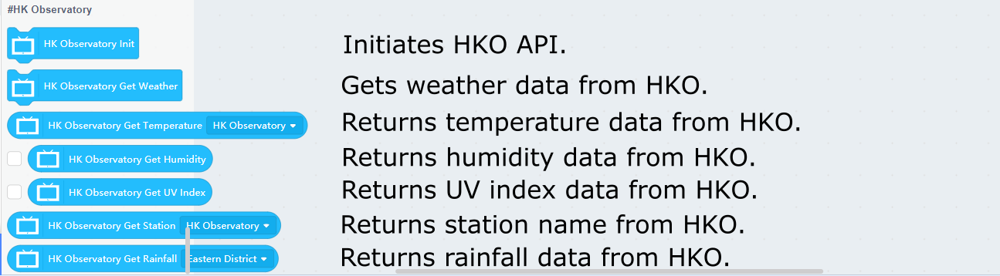

# FutureBoard and KittenBlock Quick Start Guide

KittenBlock is the main programming platform for FutureBoard.

Download KittenBlock: [Installing Kittenblock](../KittenBlock/kittenblockGreen.md)

## Establishing Connection with FutureBoard

The FutureBoard needs to be connected on KittenBlock before coding.

### 1. Connect the FutureBoard to the PC using the provided cable.

### 2. Select FutureBoard from the list.

### 3. Click on the exclamation mark and select the FutureBoard.

The connection should be finished in a few seconds.

After a few seconds, the text 'hello world' will be displayed on the screen.

Windows 7 users may require an additional driver, please refer to the last section on this page.

### 4. Testing the connection

The FutureBoard should react immediately after clicking on any blocks on KittenBlock.

You may need to update the firmware if there is no reaction.

## Kittenblock Coding Quick Start

### 1. Onboard Sensors

### 2. Buzzer

### 3. Display

### 4. Turtle

### 5. Pins

### 6. Neopixel

### 7. Microphone

### 8. WiFi & IoT

### 9. Wireless Radio

### 10. Robotbit

### 11. Basic Sensors

### 12. HK Observatory API

## Windows 7 Drivers

For Windows 7 users, please download and install the following drivers;.

[Futureboard Driver Windows 7](https://drive.google.com/file/d/1Ldx1baDITzg-bHGvWpbgyQ0NdWDFdGD4/view?usp=sharing)