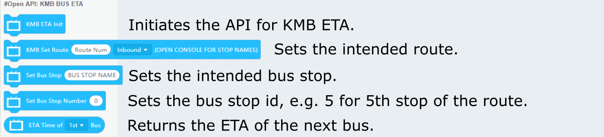
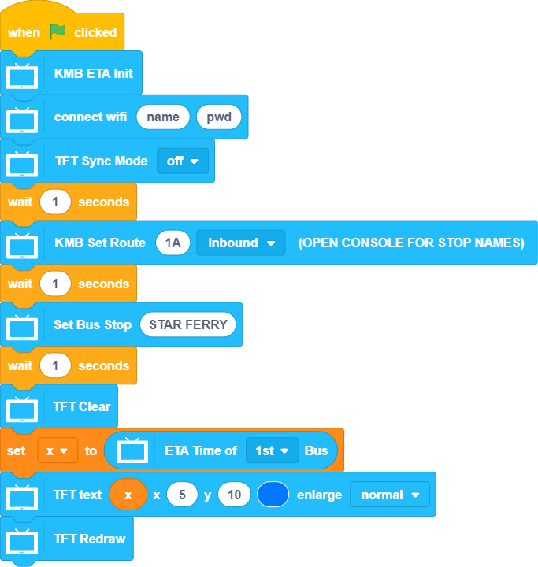

# Programming with KittenBlock: KMB ETA

KMB's Estimated Time of Arrival for bus routes can be obtained via KittenBlock.(Internet Connection Required)

## KMB ETA API Blocks

    KMB's ETA API needs to deal with a lot of data, so it may take upwards of a minute to process the data depending on the length of the route.

### Sample Program: Getting ETA of Next Bus

    KMB's ETA API needs to deal with a lot of data, so it may take upwards of a minute to process the data depending on the length of the route.

