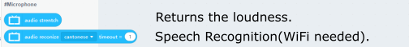
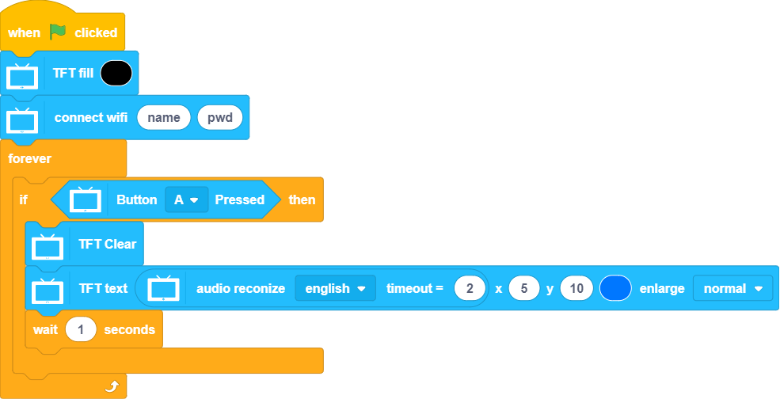

# Programming with KittenBlock: Microphone

An MEMS microphone is wired to P10 on the FutureBoard.

## Microphone Blocks

### Sample Program: Noise Level

### Sample Program: Audio Recognition

Cantonese, Mandarin and English are currently supported.

    Audio Recognition requires and Internet Connection.
    

