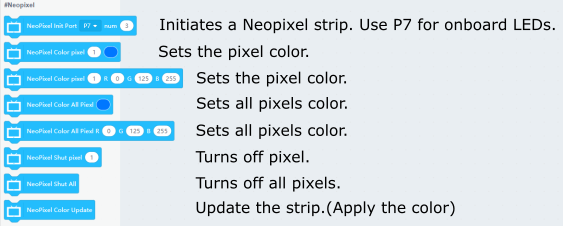

# Programming with KittenBlock: Neopixel

Common ws2812 light strips can be controlled by Futureboard.

## NeoPixel Blocks

### Sample Program: Controlling all lights

    Use P7 for the onboard light strip.
    

### Sample Program: Controlling individual lights

    Use P7 for the onboard light strip.
    
