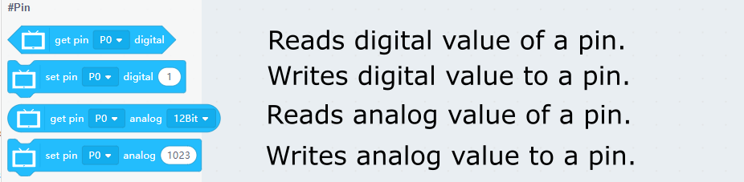

# Programming with KittenBlock: GPIO

You can connect various sensors to the edge connectors on the FutureBoard.

## GPIO Blocks

### Sample Program: Reading Analog Values

FutureBoard has a 12-bit ADC for reading analog values at a higher resolution.

### Sample Program: Writing Analog Values

### Sample Program: Reading Digital Values

### Sample Program: Writing Digital Values

