# Programming with KittenBlock: Powerbrick

The Powerbrick modules are compatible to use with FutureBoard.

## Powerbrick Blocks

### AB Button Module

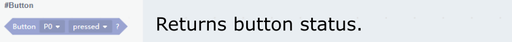

### IR Tracker Module

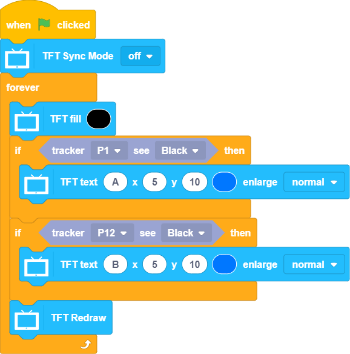

### MP3 Module

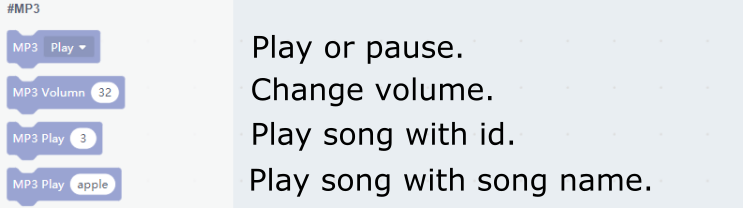

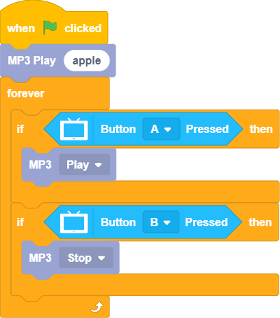

### RFID Module

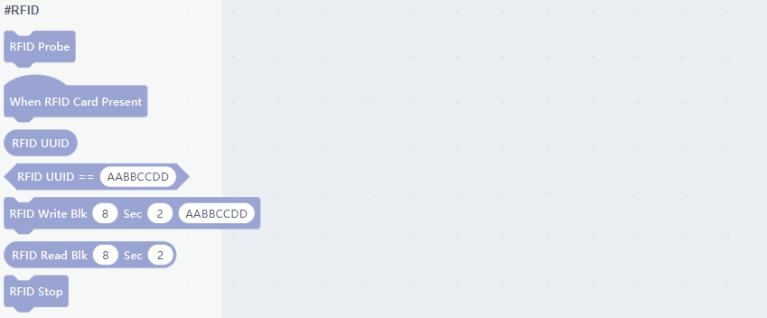

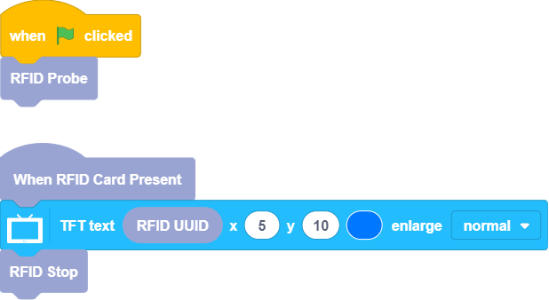

### Color&Gesture Module

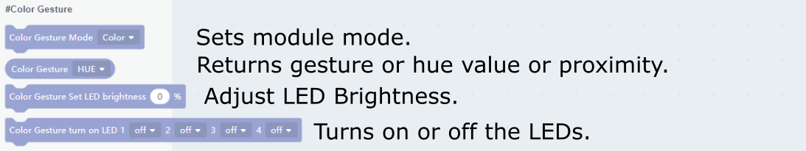

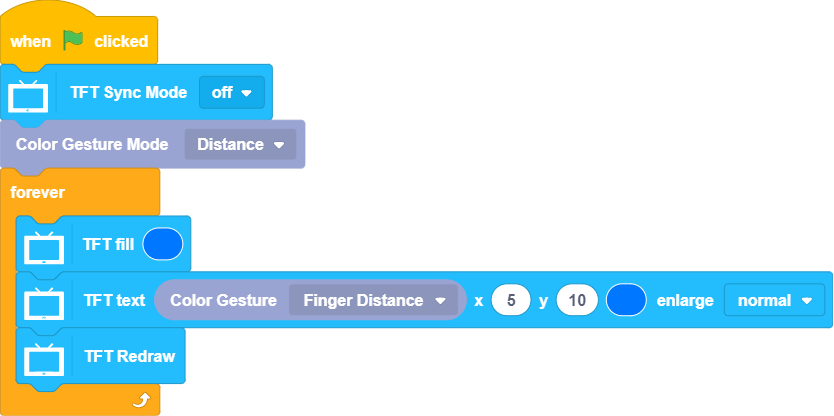

### Environment Temperature and Humidity Module

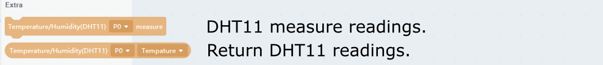

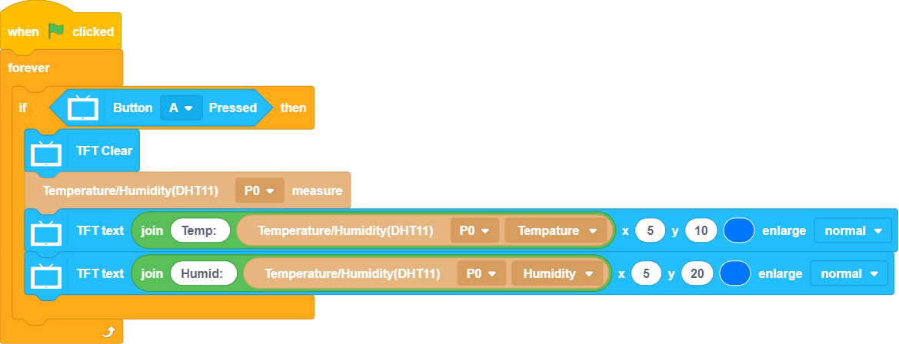

### Soil Moisture and Water Level Sensor

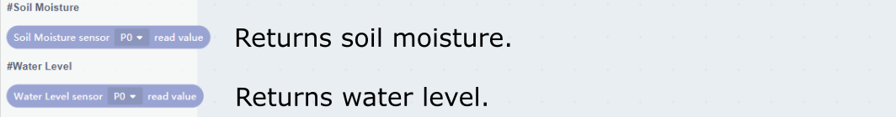

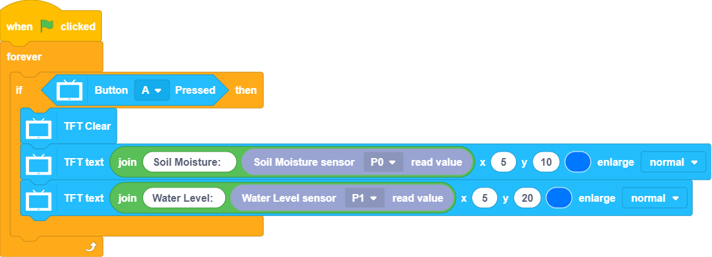

### RGB Module

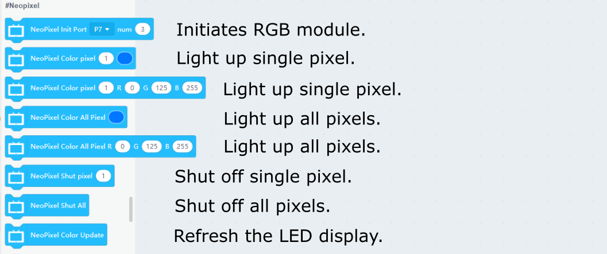

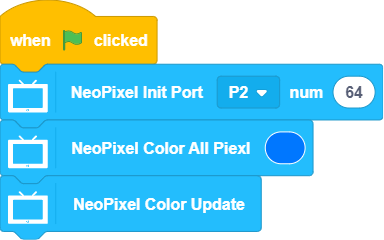

## Note:

FutureBoard is not compatible with Armourbit, please use the PowerBrick modules with a RobotBit.