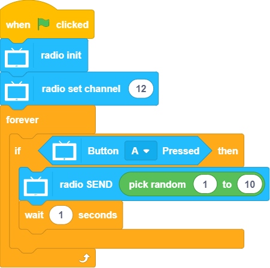
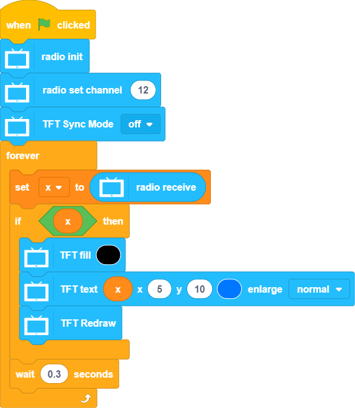

# Programming with KittenBlock: Radio

Futureboard can communicate with each other via the 2.4GHz wireless radio.

## Radio Blocks

### Sample Program: Transmission Device

### Sample Program: Receiving Device

