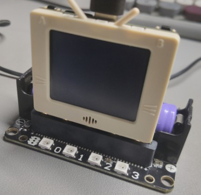
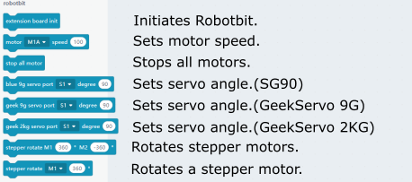
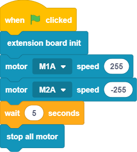
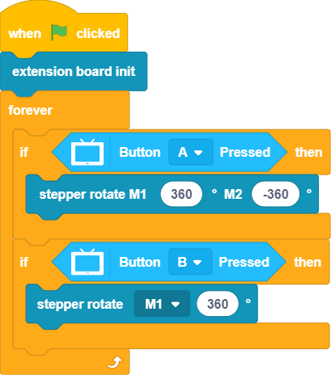
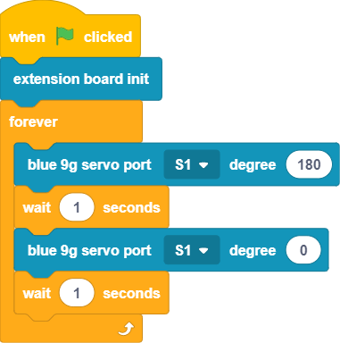
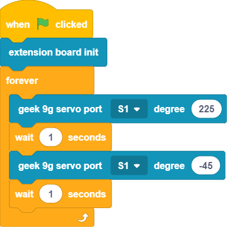
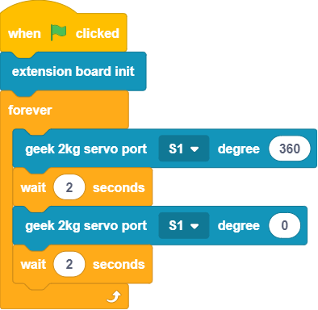
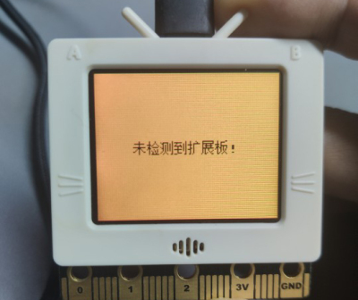

# Programming with KittenBlock: Robotbit

The FutureBoard can be used with a Robotbit to add powered functions to your creations.

## Robotbit Blocks

### Sample Program: Motors

### Sample Program: Stepper Motor

### Sample Program: Servos

### Sample Program: GeekServo 9G

### 範例程式：驅動GeekServo 2KG舵機

## Note:

The FutureBoard will stop running any code that has Robotbit code when it is not installedon a Robotbit.

