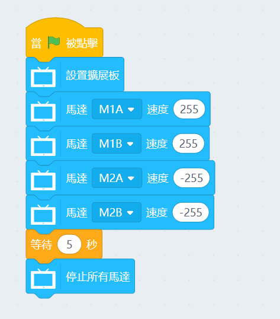
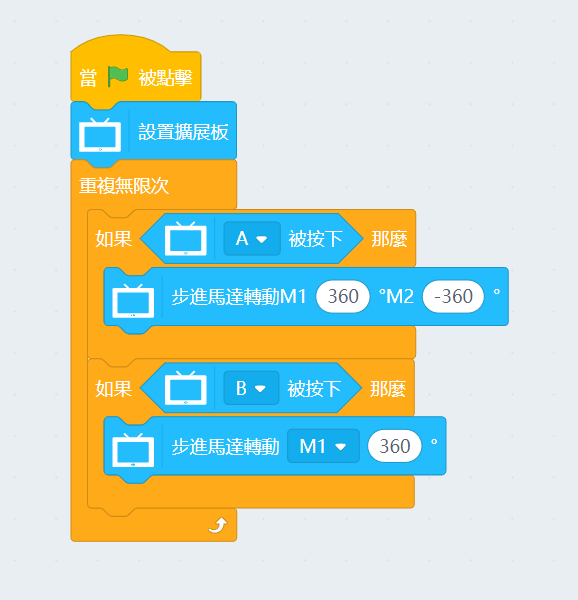
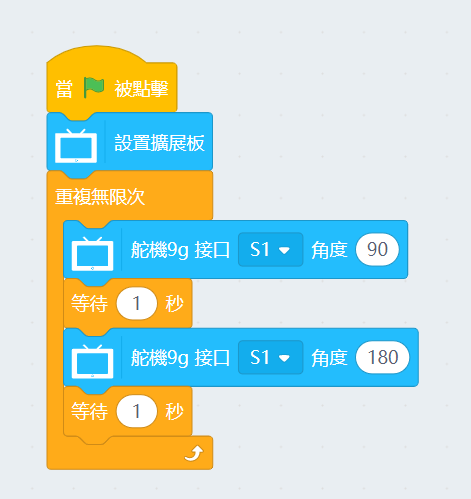
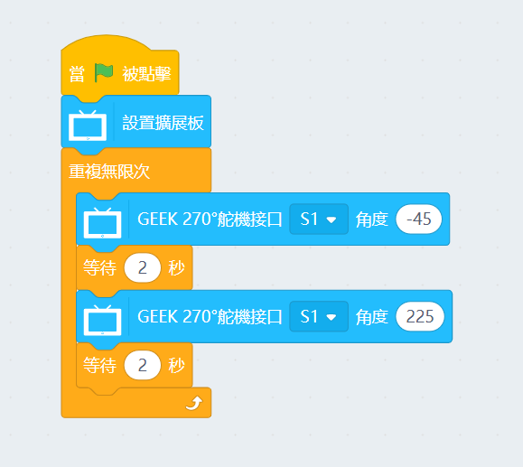
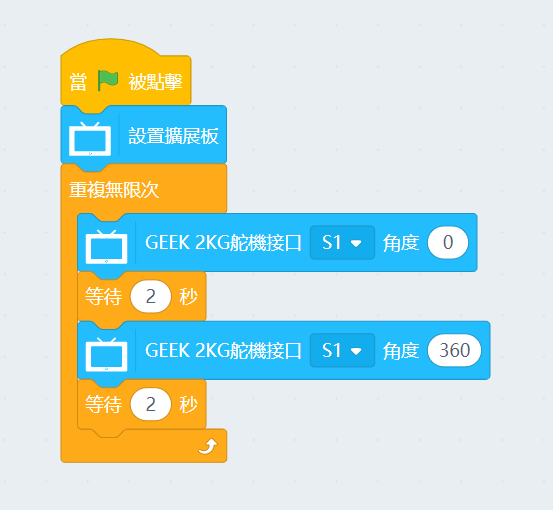

# Programming with KittenBlock: Robotbit

The FutureBoard can be used with a Robotbit to add powered functions to your creations.

## Robotbit積木塊

### 範例程式：驅動電機

### 範例程式：驅動步進電機

### 範例程式：驅動一般舵機

### 範例程式：驅動GeekServo  9G舵機

### 範例程式：驅動GeekServo 2KG舵機

## Robotbit注意事項

假如程序含有Robotbit的積木但未來板又未有插進Robotbit，未來板會顯示以下警告，阻止程序運行。

請將未來板插上Robotbit後重試。

