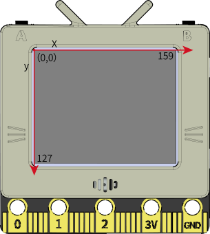
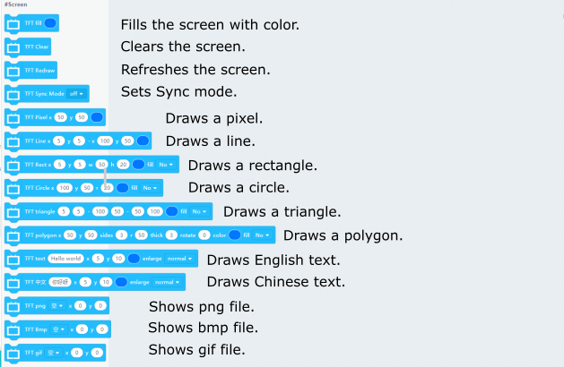
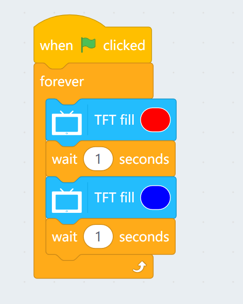
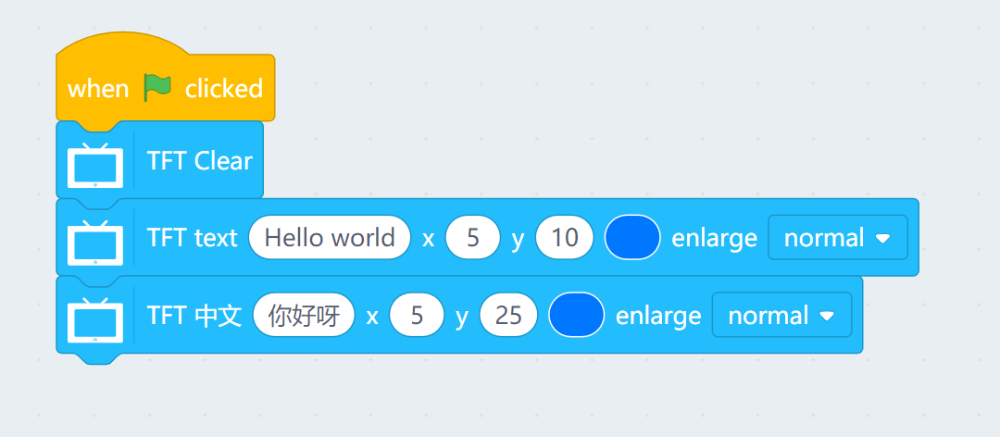
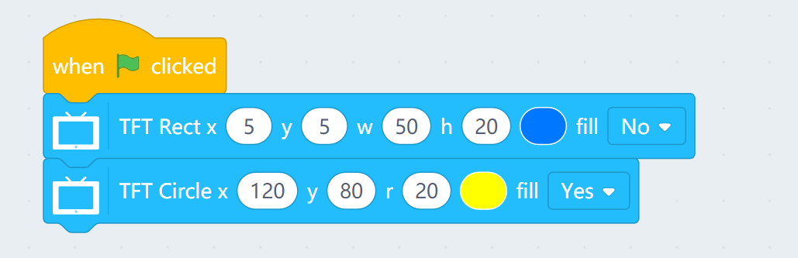
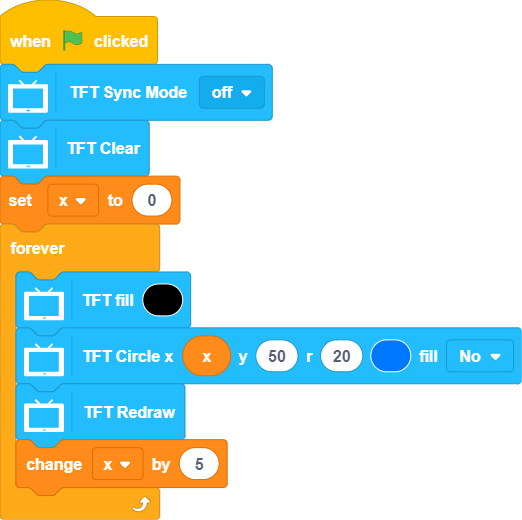
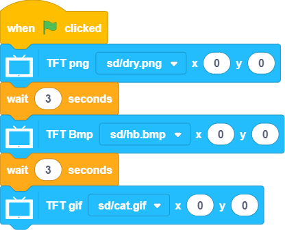

# Programming with KittenBlock: Screen

The TFT screen can be used to display various effects.

## Screen Blocks

### Sample Program: Filling Colors

### Sample Program: Showing Text

The screen can show English and Chinese texts.

### Sample Program: Pixels and Lines

To be added.

### Sample Program: Rectangles and Circles

    Note: The coordinates define the top left corner for rectangles, the origin for circles.

### Sample Program: Triangles and Polygons

To be added.

### Sample Program: Sync Mode

Disabling Sync Mode helps with smooth animations by eliminating screen flashings。

### Sample Program: Showing Images

FutureBoard is capable of showing png, bmp or gif files.

Put the images on the SD card.

