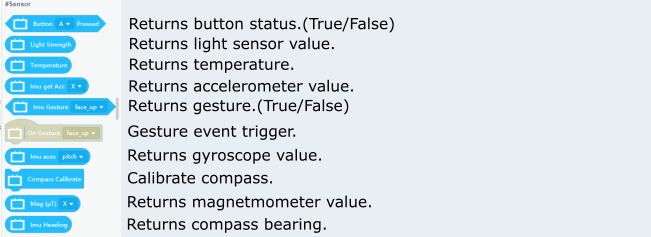

# Programming with Kittenblock: Onboard Sensors

There are multiple onboard sensors on Futureboard.

## Onboard Sensors Blocks

### Sample Program: Buttons

Pressing the buttons changes the color.

### Sample Program: Temperature and Light sensors

The sensor values are shown on the screen.

### Sample Program: Accelerometer and Gyroscope

Please refer to the following figure for the axis orientation.

The acceleration values are shown on the screen.

### Sample Program: Gestures

The Futureboard can detect 8 gestures:

1. 'shake' 
2. 'freefall'
3. 'tilt_up'
4. 'tilt_down'
5. 'tilt_left'
6. 'tilt_right'
7. 'face_up'
8. 'face_down'

Shake the FutureBoard for a sound.

### Sample Program: Gesture Triggers

Shake the FutureBoard for a sound.

    Note: Trigger Events only work when the program is uploaded onto the FutureBoard.

### Sample Program: Gyroscope

Shows the roll and pitch of the FutureBoard.

### Sample Program: Magnetic Sensor

The magnetic sensor has a range of ±800(μT)。

The magnetic strengths are shown on FutureBoard.

    The magnetic sensor needs to be calibrated before use.

### Sample Program: Compass

The compass returns a compass bearing, with 0 indicating North.

The compass bearing is shown.

