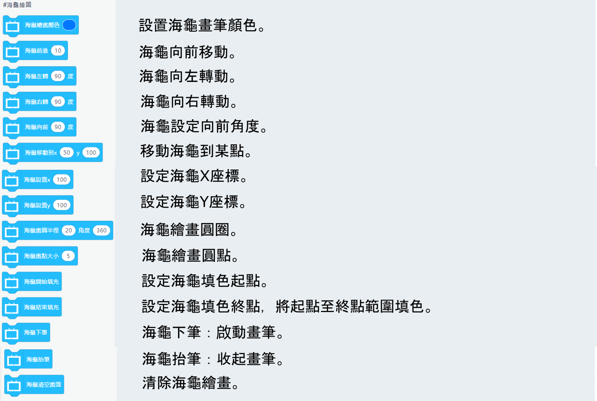
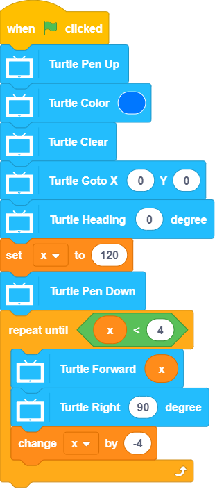
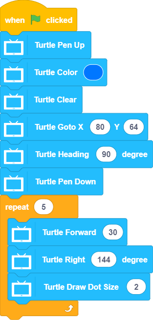
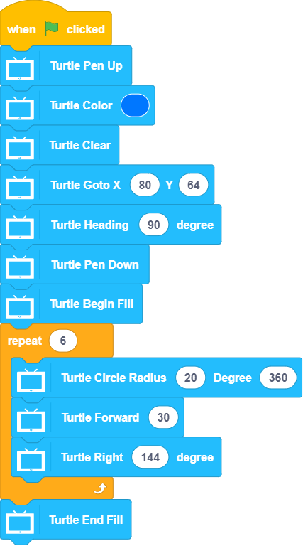

# Programming with KittenBlock: Turtle

Turtle is a popular tool for learning the basics of programming.

## Turtle Blocks

    Note: The fill function may not function as intended as the pixel specifications are below Turtle's requirements.

### Sample Program: Basic Lines

### Sample Program: 5-Pointed Star

### Sample Program: Flower

