# Programming with MicroPython: Screen and Display

## Import FutureBoard Library

Import the Library to make use of its functions.

    from future import *
    
## 01: TFT

### 1. Screen fill

    screen.fill(color)
    
color can be used in a few ways:

1. RGB, 0~255, for example (255,100,0).
2. Grey scale, 0~255, for example 100.
3. Built-in color, supported colors: RED, YELLOW, PINK, WHITE, GREEN, BLUE, PURPLE, CYAN, BLACK.

    
    screen.fill((255,100,0))

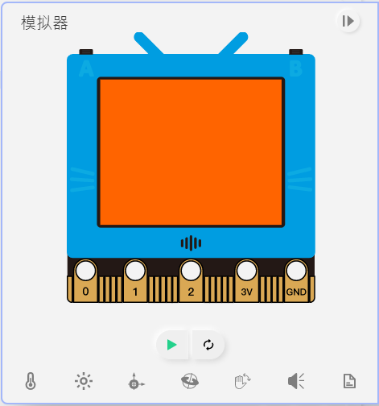

### 2. Draw pixel

    screen.pixel(x,y,color)
    
(x,y) refer to the coordinates, ranges from 0~159 and 0~127 respectively.
    
color can be used in a few ways:

1. RGB, 0~255, for example (255,100,0).
2. Grey scale, 0~255, for example 100.
3. Built-in color, supported colors: RED, YELLOW, PINK, WHITE, GREEN, BLUE, PURPLE, CYAN, BLACK.

    screen.pixel(50,50,(255,100,0))

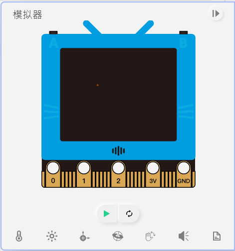

### 3. Draw lines

    screen.line(x1,y1,x2,y2,color)
    
(x1,y1) and (x2, y2) are the coordinates of the line, x and y range from 0~159 and 0~127 respectively.

color can be used in a few ways:

1. RGB, 0~255, for example (255,100,0).
2. Grey scale, 0~255, for example 100.
3. Built-in color, supported colors: RED, YELLOW, PINK, WHITE, GREEN, BLUE, PURPLE, CYAN, BLACK.

    screen.line(50,50,100,100,(255,100,0))

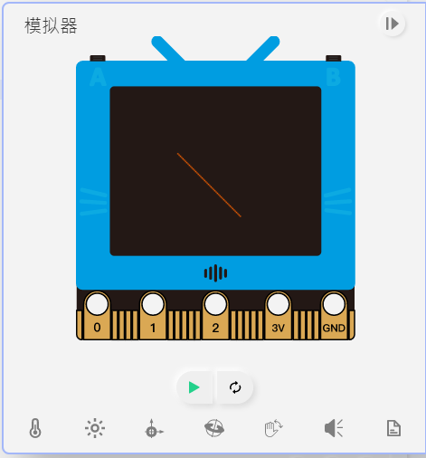

### Sample Program for 1~3

    from future import *
    
    screen.fill(BLACK)
    screen.pixel(80,62,(200,200,0))
    screen.pixel(80,64,(200,200,0))
    screen.pixel(80,66,(200,200,0))
    screen.line(30,30,90,90,255)

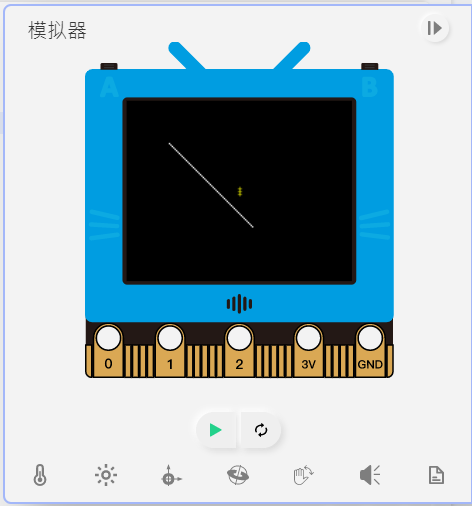
    
-----------------------

### 4. Draw Rectangles

    screen.rect(x,y,w,h,color,fill)
    
(x,y) is the top left corner coordinates of the rectangle, x and y range from 0~159 and 0~127 respectively.

Parameters w and h are the width and height.
    
color can be used in a few ways:

1. RGB, 0~255, for example (255,100,0).
2. Grey scale, 0~255, for example 100.
3. Built-in color, supported colors: RED, YELLOW, PINK, WHITE, GREEN, BLUE, PURPLE, CYAN, BLACK.

Use fill to select whether to fill the shape with a color, 1 for true, 0 for false.

    screen.rect(20,20,100,50,(255,100,0),1)

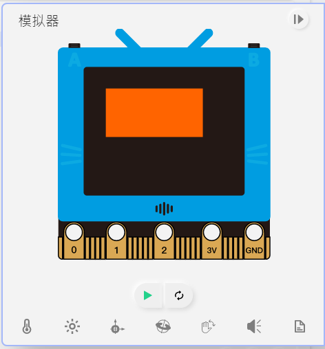

### 5. Draw Circles

    screen.circle(x,y,r,color,fill)
    
(x,y) is the center coordinates of the circle, x and y range from 0~159 and 0~127 respectively.

Parameter r is the radius.
    
color can be used in a few ways:

1. RGB, 0~255, for example (255,100,0).
2. Grey scale, 0~255, for example 100.
3. Built-in color, supported colors: RED, YELLOW, PINK, WHITE, GREEN, BLUE, PURPLE, CYAN, BLACK.

Use fill to select whether to fill the shape with a color, 1 for true, 0 for false.

    screen.circle(50,50,20,(255,100,0),1)

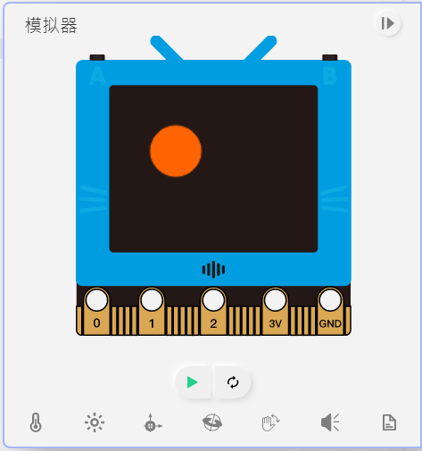

### 6. Draw Triangles

    screen.triangle(x1,y1,x2,y2,x3,y3,color,fill)
    
(x1,y2), (x2,y2), (x3,y3) represent the coordinates of the three corners of a triangle, x and y range from 0~159 and 0~127 respectively.

color can be used in a few ways:

1. RGB, 0~255, for example (255,100,0).
2. Grey scale, 0~255, for example 100.
3. Built-in color, supported colors: RED, YELLOW, PINK, WHITE, GREEN, BLUE, PURPLE, CYAN, BLACK.

Use fill to select whether to fill the shape with a color, 1 for true, 0 for false.

screen.triangle(50,50,10,75,90,75,(255,100,0),1)

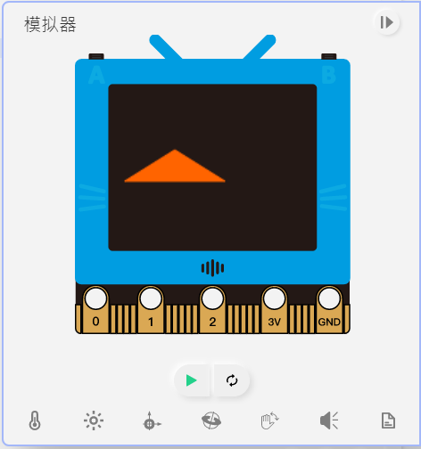

### 7. Draw Polygons

    screen.polygon(x,y,sides,r,th,rot,color,fill)
    
(x,y) is the center coordinates of the polygon, x and y range from 0~159 and 0~127 respectively.

Parameter side denotes the number of sides of the polygon, cannot be lower than 3.

Parameter is the radius of the polygon.

Parameter th is the thickness of the border.

Parameter rot is the rotation angle of the polygon.

color can be used in a few ways:

1. RGB, 0~255, for example (255,100,0).
2. Grey scale, 0~255, for example 100.
3. Built-in color, supported colors: RED, YELLOW, PINK, WHITE, GREEN, BLUE, PURPLE, CYAN, BLACK.

Use fill to select whether to fill the shape with a color, 1 for true, 0 for false.

    screen.polygon(50,50,6,40,2,225,(255,100,0),0)

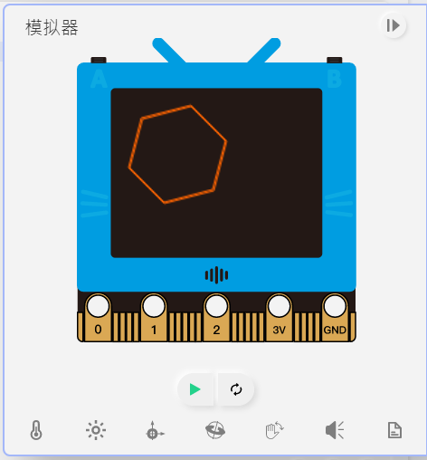

### Sample Program for 4~7

    from future import *
    
    screen.fill((0, 0, 0))
    screen.rect(5,5,50,20,(0, 119, 255),1)
    screen.circle(50,50,20,(170, 0, 0),0)
    screen.triangle(10,50,60,100,10,100,(0, 170, 0),0)
    screen.polygon(120,50,5,30,3,0,(255, 255, 0),1)

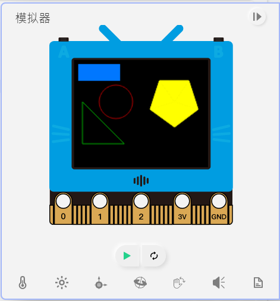

------------

### 8. Show English Strings

    screen.text(text, x=0, y=0, ext=1, color=255)
    
(x,y) is the top left corner coordinates of the text, x and y range from 0~159 and 0~127 respectively.

Parameter ext represents the size of the text, 1 for 8x8, 2 for 16x16 and et-cetera.

color can be used in a few ways:

1. RGB, 0~255, for example (255,100,0).
2. Grey scale, 0~255, for example 100.
3. Built-in color, supported colors: RED, YELLOW, PINK, WHITE, GREEN, BLUE, PURPLE, CYAN, BLACK.

    screen.text("hello world", 10, 10, 2, (255,100,0))

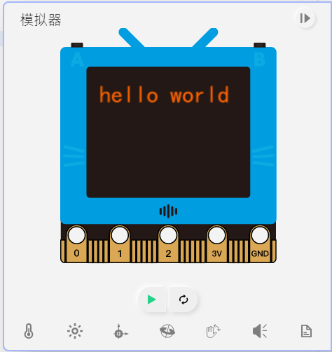

### 9. Show Chinese Strings

    screen.textCh(text, x=0, y=0, ext=1, color=255)

(x,y) is the top left corner coordinates of the text, x and y range from 0~159 and 0~127 respectively.

Parameter ext represents the size of the text, 1 for 8x8, 2 for 16x16 and et-cetera.

color can be used in a few ways:

1. RGB, 0~255, for example (255,100,0).
2. Grey scale, 0~255, for example 100.
3. Built-in color, supported colors: RED, YELLOW, PINK, WHITE, GREEN, BLUE, PURPLE, CYAN, BLACK.

    screen.textCh("你好", 10, 10, 2, (255,100,0))

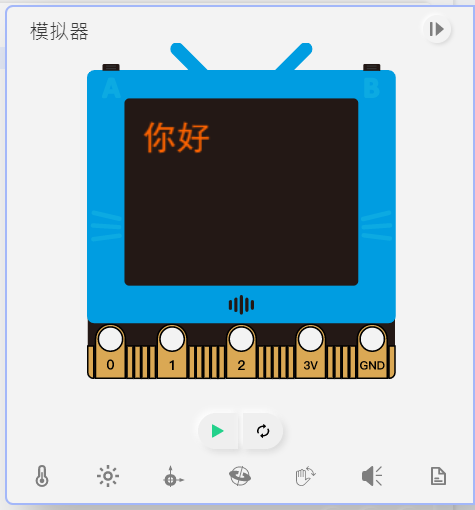

### Sample Program for 8~9

    from future import *
    
    screen.text('hello world',5,5,1,RED)
    screen.textCh('你好',5,25,2,WHITE)

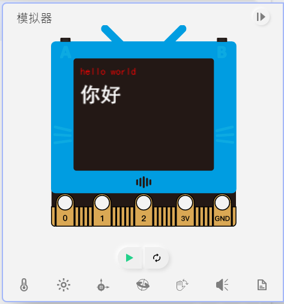
    
----------------

### 10. Showing Images

    screen.loadBmp(path, x=0, y=0)
    screen.loadPng(path, x=0, y=0)
    screen.loadGif(path, x=0, y=0)
    
(x,y) is the top left corner coordinates of the image, x and y range from 0~159 and 0~127 respectively.

### Sample Program for 10

[Download Testing Files(Right Click->Save As)](https://kittenbothk-eng.readthedocs.io/en/latest/futureboard/images/pics.rar)

    # Showing png
    from future import *
    screen.loadPng('hmP.png')

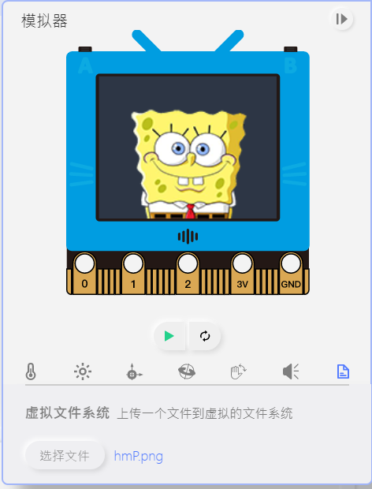
    
    # Showing gif
    from future import *
    while 1:
        screen.loadGif('hmG.gif')
        
### 11. Screen Sync

    screen.sync = val
    
Enables or disables the screen sync, 1 for enabled and 0 for disabled.

### 12. Screen Refresh

    screen.refresh()

Redraws the frame.
    
### Sample Program for 11~12

    # Screen flashing can be eliminated by turning off screen sync and manually refresh screen
    from future import *
    screen.sync = 0
    x=0
    while True:
      screen.fill((0, 0, 0))
      screen.circle(x,50,10,(0, 255, 0),1)
      screen.refresh()
      x += 1

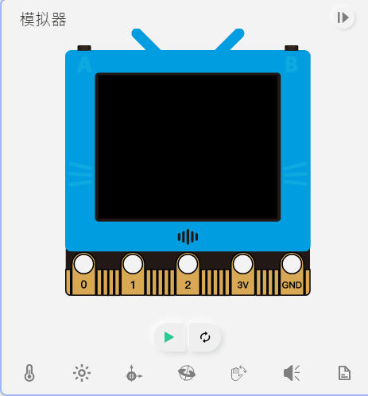
  
--------