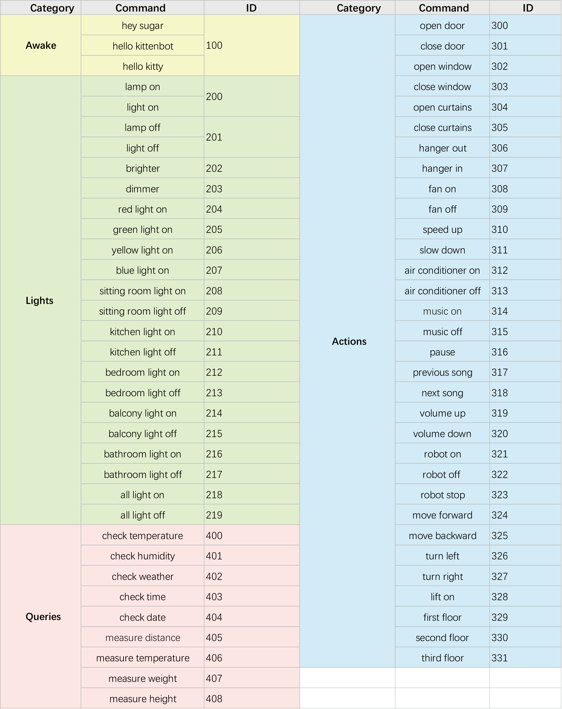
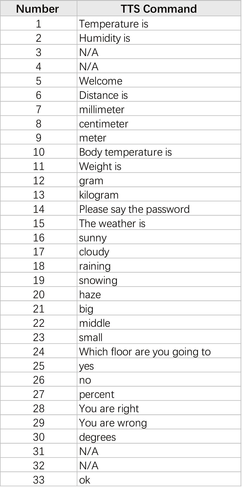

# Programming with MicroPython: ASR Voice Recognition Module

## Import ASR Library

Import SugarASR library to make use of its functions.

    from sugar_asr import SugarASR

## 15: ASR Voice Recognition Module

## Initiate ASR Module

    asr = SugarASR(tx, rx)

Creates an ASR object.

- tx: Tx Pin, use "P2" for Robotbit Edu.
- rx: Rx Pin, use "P12" for Robotbit Edu.

## ASR Triggered State

    asr.detected()

Returns the state of ASR module. Returns true when a command is heard, false when a command is not heard.

## Get ASR Command

    asr.cmdParse()

Returns the command ID for the voice command heard by the ASR. Refer to the following table for a list of commands.

## ASR Play Speech

    asr.tts_words(1)

Plays the speech indicated by the ID.

## ASR Say Number

    asr.tts_int(1) #Integer
    asr.tts_double(1.1) #Double, maximum 2 decimal digits

Say the number provided.

## ASR Say Time

    asr.tts_clock(hour, min)

Say the time provided.