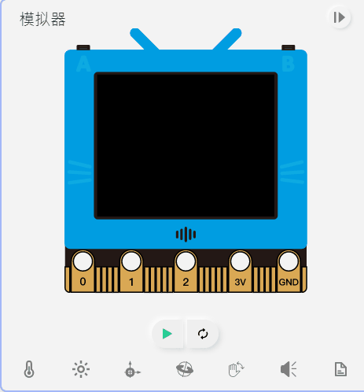

# Programming with MicroPython: Onboard Sensors

## Import FutureBoard Library

Import the Library to make use of its functions.

    from future import *

## 02: Onboard Sensors

### 1. Buttons

    sensor.btnValue(btn)
    
Parameter btn represents A or B button, accepted values are a, b.

### 2. Light Sensor

    sensor.getLight()
    
Returns a value 0~4095.

### 3. Temperature Sensor

    sensor.getTemp()
    
Returns a degree in Celsius, FutureBoard can measure temperatures from -40 to 80 degrees.

### Sample Program for 1~3

    from future import *
    
    from time import sleep
    
    screen.fill((0, 0, 0))
    while True:
      if sensor.btnValue('a'):
        screen.text(str("Light: ")+str(sensor.getLight()),5,10,1,(0, 119, 255))
        sleep(0.5)
      if sensor.btnValue('b'):
        screen.text(str("Temp: ")+str(sensor.getTemp()),5,30,1,(0, 119, 255))
        sleep(0.5)

-----------------

### 4. Accelerometer

    sensor.accX()
    sensor.accY()
    sensor.accZ()
    
Returns the accelerometer value of the 3 axis with G as the unit.

### 5. Tilt Angles

    sensor.roll()
    sensor.pitch()
    
Returns the roll and pitch angle of the FutureBoard.

### Sample Program for 4~5

    #The screen displays the readings of the accelerometer.

    from future import *

    from time import sleep
    
    screen.sync = 0
    while True:
      screen.fill((0, 0, 0))
      screen.text(str("X: ")+str(sensor.accX()),5,10,1,(0, 119, 255))
      screen.text(str("Y: ")+str(sensor.accY()),5,25,1,(0, 119, 255))
      screen.text(str("Z: ")+str(sensor.accZ()),5,40,1,(0, 119, 255))
      screen.text(str("Roll: ")+str(sensor.roll()),5,55,1,(0, 119, 255))
      screen.text(str("Pitch: ")+str(sensor.pitch()),5,70,1,(0, 119, 255))
      screen.refresh()
      sleep(0.2)

---------------

### 6. Gesture Detection

    sensor.gesture(gesture)

8 kinds of gesture can be detected by the FutureBoard.

1. 'shake'
2. 'freefall'
3. 'tilt_up'
4. 'tilt_down'
5. 'tilt_left'
6. 'tilt_right'
7. 'face_up'
8. 'face_down'

### 7. Gesture Event Trigger

    sensor.gesTrig[ges] = fn
    sensor.startSchedule()
    
### Sample Program for 6~7

    # Futureboard plays a melody on shake.
    # Futureboard shows the status of gestures face up and face down.

    from future import *
    
    from time import sleep

    def onGesture_shake():
      buzzer.melody(JUMP_UP)
    
    sensor.gesTrig['shake']=onGesture_shake
    sensor.startSchedule()
    
    screen.sync = 0
    while True:
      screen.fill((0, 0, 0))
      screen.text(str("Face Up: ")+str(sensor.gesture('face_up')),5,10,1,(0, 119, 255))
      screen.text(str("Face Down: ")+str(sensor.gesture('face_down')),5,25,1,(0, 119, 255))
      screen.refresh()
      sleep(0.2)

-----------------

### 8. Compass Calibration

    calibrateCompass()
    
Magnetometer and compass requires calibration before using.

### 9. Magnetic Strength

    sensor.magX()
    sensor.magY()
    sensor.magZ()
    sensor.magStrength()
    
Returns the magnetic strength detected by the sensor with uT as the unit.

### 10. Compass Bearing

    sensor.heading()
    
Returns the compass bearing.

### Sample Program for 8~10

    # Simulates a compass

    from future import *
    import math
    calibrateCompass()
    screen.sync = 0
    ds = ''
    while 1:
        d = int(math.fabs(360-sensor.heading()))
        screen.fill(44)
        if (d<20) | (d>340):
            ds = 'N'
        elif (d<70):
            ds = 'NE'
        elif (d<110):
            ds = 'E'
        elif (d<160):
            ds = 'SE'
        elif (d<200):
            ds = 'S'
        elif (d<250):
            ds = 'SW'
        elif (d<290):
            ds = 'W'
        else:
            ds = 'NW'
        screen.text(d, 5,5)
        screen.textCh(ds,5,30)
        screen.text(str('Strength: ')+str(sensor.magStrength()),5,80)
        screen.refresh()
        
--------------------