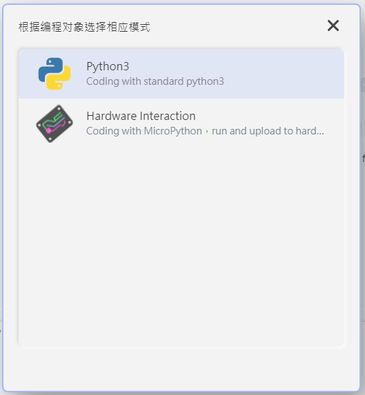
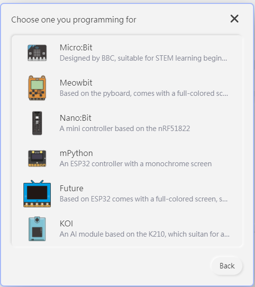
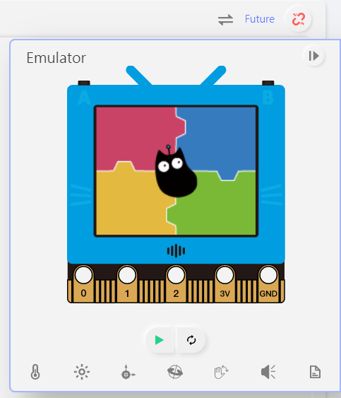
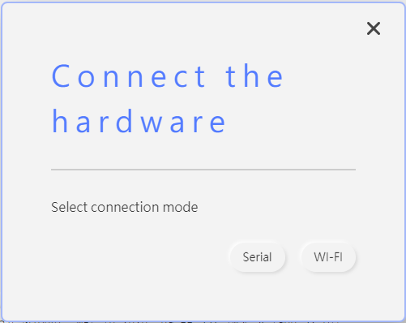
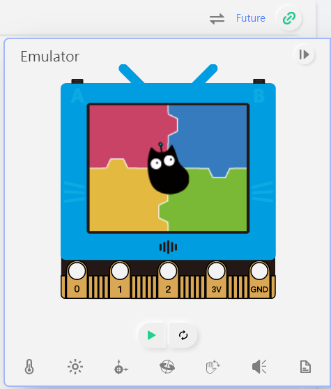
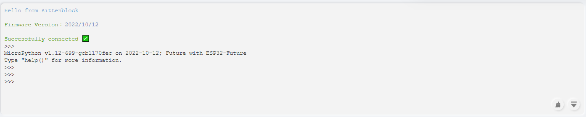

# FutureBoard & MicroPython QuickStart

FutureBoard runs on MicroPython, KittenBot recommends KittenCode or KittenBlock for programming your FutureBoard with Micropython.

## Using FutureBoard on KittenCode

Make sure KittenCode is installed.

## 1. Launch KittenCode and change to Hardware Interaction mode

### 2. Select FutureBoard

### 3. Connect the FutureBoard using the USB Cable and press the connect button

### 4. Select Serial Mode

### 5. The connection is established when the button turns green

### 6. The REPL console also becomes available

