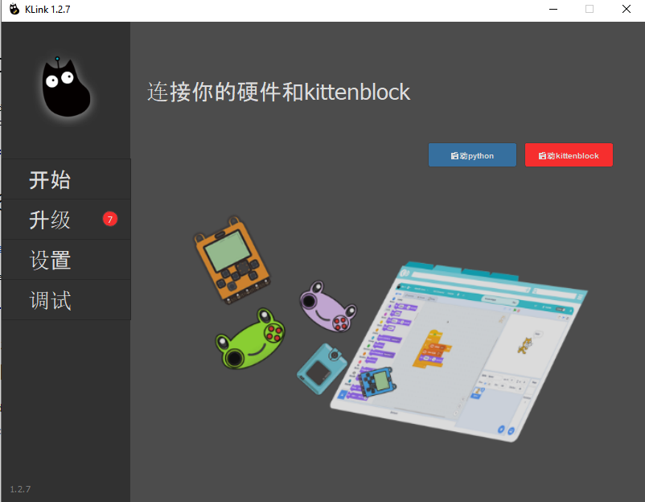
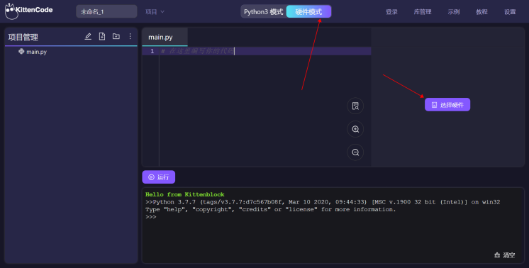
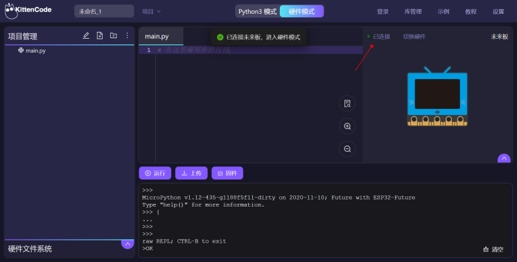
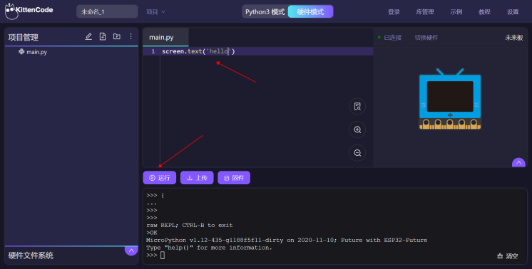

# FutureBoard & MicroPython QuickStart

FutureBoard runs on MicroPython, KittenBot recommends KittenCode or KittenBlock for programming your FutureBoard with Micropython.

## Using FutureBoard on KittenCode

Make sure KLink is installed.

### 1. Select KittenCode on KLink

### 2. Select FutureBoard on KittenCode

### 3. Connect to FutureBoard

### 4. Test the connection with a simple program

