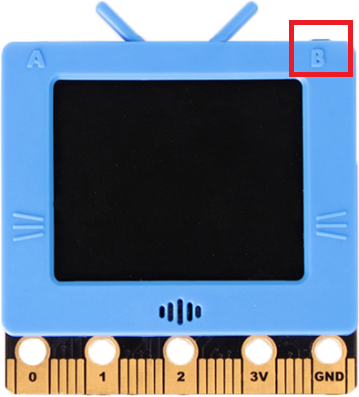

# Resetting the FutureBoard

A reset may be required after updating the firmware.

## How to Reset

### 1. Press and hold B.

### 2. Press the reset button once.

### 3. Hold B for 2 more seconds and release.

### 4. The start up animation will load, indicating a successful reset.