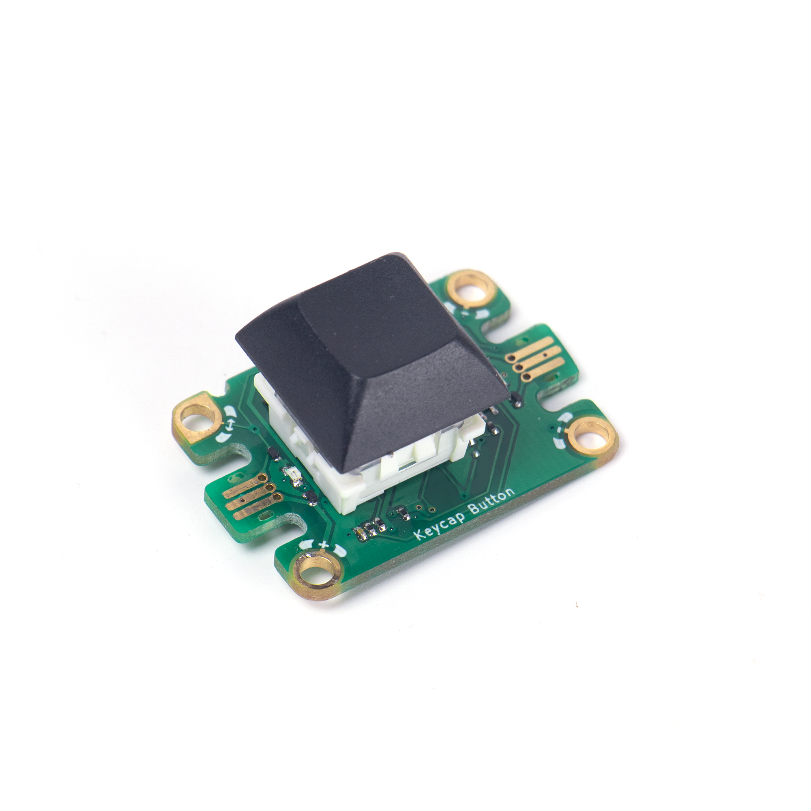
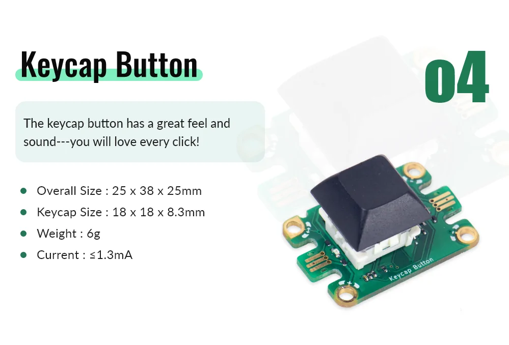
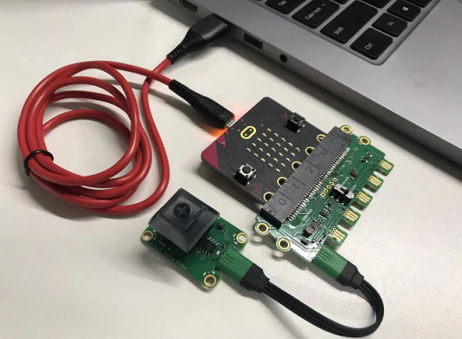
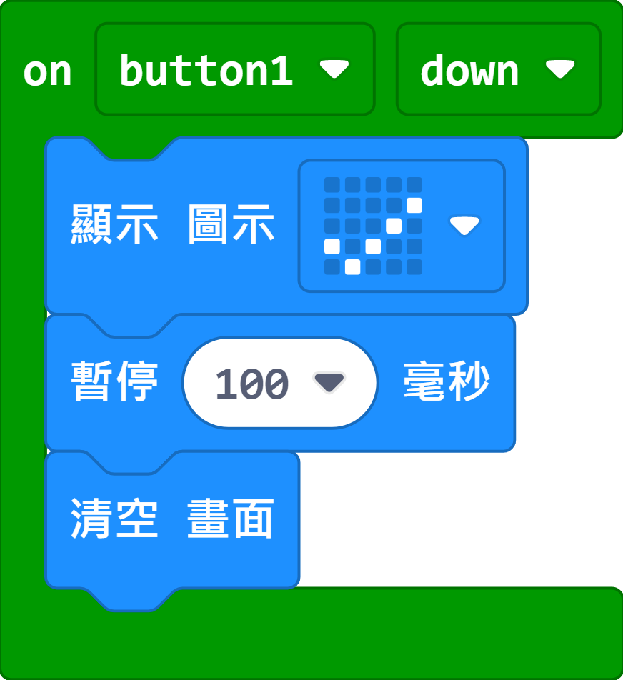

# Jacdac Kecap Button Module

This keycap button module uses a high quality key switch found in mechanical keyboards to improve the tactile feeling and a satisfying click.

## Product Specifications

## Sample Wiring

## MakeCode Programming Tutorial

### Sample Program

The Micro:bit will show an icon when the button is pressed.

[Sample Program](https://makecode.microbit.org/_Vu8ECbJU2WKE)