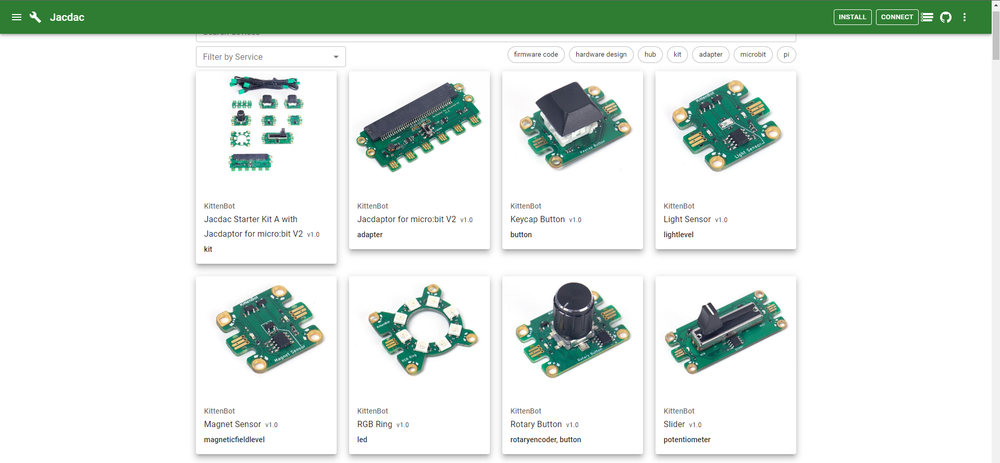
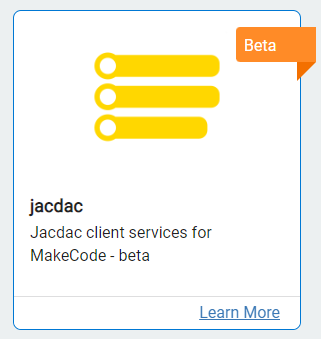
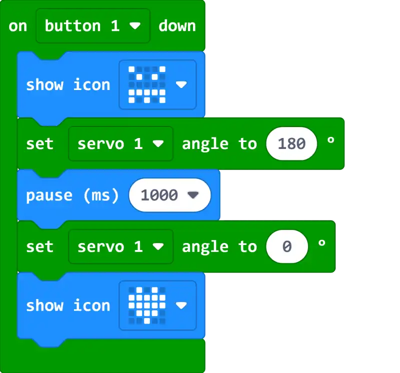
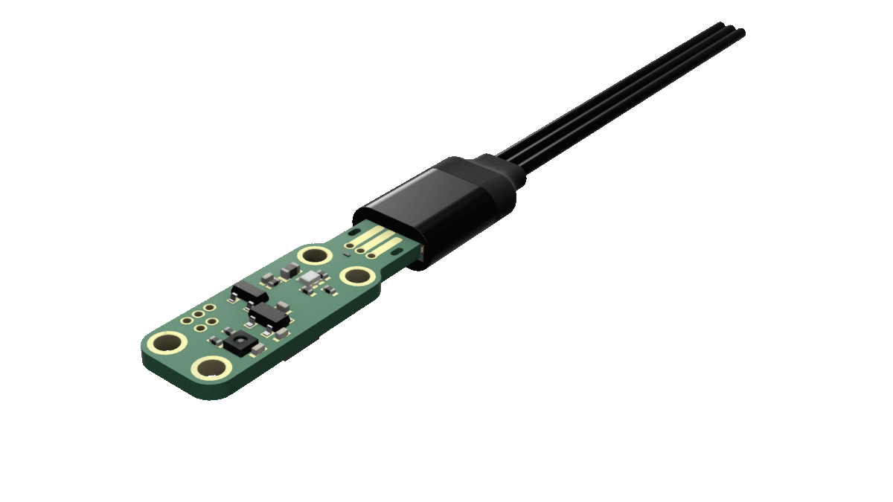
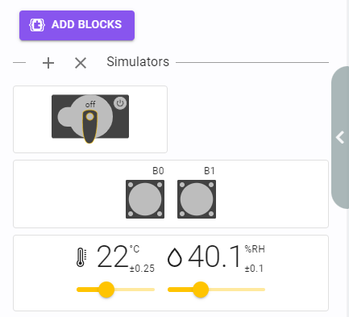
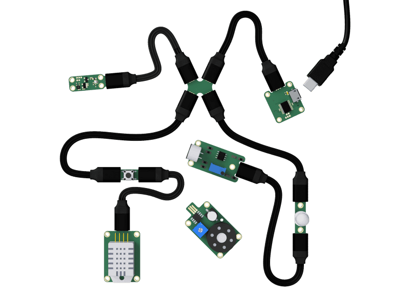

# What is Jacdac?

Jacdac is a new hardware and software standard for electronic components developed by Microsoft, Jacdac has a huge emphasize on modularity, allowing each component to plug-and-play. It's modular design is suitable for quick prototyping, allowing users quickly explore ideas and experiments with different hardware. Jacdac makes electronics more flexible and expandable, its low cost enables electronics programming and hardware hacking lowers the entry barrier for electronics programming and hardware hacking.

### [Microsoft Jacdac Official Website](https://microsoft.github.io/jacdac-docs/)

## Microsoft's Jacdac and Kittenbot

Jacdac is supported by many MCUs, including PC, Portable Devices, Arduino and Raspberry Pi.

### As for Micro:bit support and the design and manufacture of Jacdac-compatible electronic components, Microsoft has partnered with Kittenbot as the official development collaborator in designing and developing Jacdac modules for Micro:bit and other MCUs.

### [Microsoft Official Blog: Jacdac & Micro:bit](https://medium.com/@jacdac/jacdac-for-makecode-and-the-micro-bit-887291d60f3c)

### [Hackster.io: Microsoft and Kittenbot launch the first Jacdac standard microcontroller kits and software](https://www.hackster.io/news/microsoft-kittenbot-launch-the-first-jacdac-standard-microcontroller-kits-and-software-apis-9faec87abe70)

## Jacdac & Micro:bit

Jacdac is supported on Micro:bit V2, it is easy and simple to program a Micro:bit V2 to interface with Jacdac modules on Microsoft MakeCode.

Jacdac requires hardware that conforms to the Jacdac standard to work, currently Kittenbot is the only company manufacturing Jacdac kits and modules.

The Jacdapter provides 6 Jacdac ports for Micro:bit V2.

## Learn More About Jacdac

Prior to the development of Jacdac, Microsoft conducted extensive research and interviews with Education Institutes and STEM companies and discovered there are a few problems with existing expansion hardware for Micro:bit.

- Difficulty in finding correct programming blocks
    - Users have to import extensions for each electronic components then they have to find the correct block from all the blocks
- Consistency between each extensions
    - It is confusing when different manufacturers have their own extensions
- Lacks simulator support
    - Users cannot simulate and predict the effects when programming
- Wiring methods are not suitable for educational purposes
    - Most hardware ports and cables are designed for engineers and are difficult to students
    - Different modules may have different connectors
    
In sight of these issues, Microsoft has integrated multiple features into Jacdac to improve the user experience.

All Jacdac components will use the same official extension, no matter the type or manufacturer, making it easy for users to program their specific hardware.

Jacdac sets a standards for its components, all Jacdac modules need to follow the same hardware design regulations, including the dimensions of the PCB, current and safety limits, including the edge connectors design.

All Jacdac modules have the same edge connector design that makes use of a reversible cable design, simplifying the wiring process.

All Jacdac modules are supported in MakeCode's simulator, allowing testing and programming even without any hardware and allow users to quickly develop prototypes.

The Jacdac standard also has other unique features.

Jacdac has high expandability, each Jacdac modules can be connected to each other by Daisy Chaining them to other modules, making the expandability almost endless.

Jacdac supports real-time programming on MakeCode. Users can connect their Jacdac modules when programming to get real time responses.

Users can test their programs even without any hardware by using the simulator.

The PCB of Jacdac modules follow standard dimensions, allowing different modules

## Jacdac Demonstration Vidoes

### [Micro:bit Official Jacdac Demonstration](https://www.youtube.com/watch?v=Jqn2YCUkWqk)

### [First Overseas User Hands On with Jacdac Kit from Kittenbot](https://www.youtube.com/watch?v=VMBNxTSGWsI)
