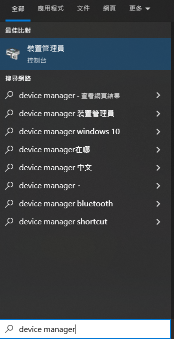
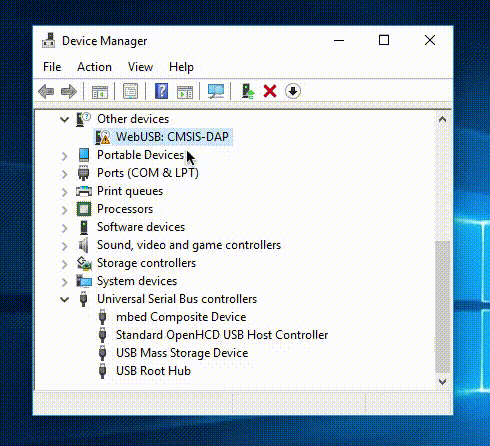

# Jacdac MakeCode Programming QuickStart Guide

This guide will teach you how to start Jacdac programming on MakeCode with Micro:bit V2.

### Note: Jacdac only supports Micro:bit V2

## 1. Import Jacdac extension in a MakeCode project

## 2. Connect a Micro:bit V2 to MakeCode then download the hex onto the Micro:bit

## 3. Connect any Jacdac modules to Micro:bit, MakeCode will automatically update the list of modules, click add blocks to generate the programming blocks for the modules

### Use the simulator to simulate Jacdac modules if you don't have the modules

### Simply search for the module you want in the simulator

## Fix for Micro:bit Unable to Connect to MakeCode

If your Micro:bit cannot connect with MakeCode, please try the following.

1. Update your internet browser

2. Update Micro:bit's Firmware

3. Reinstall mbed driver

### How to reinstall mbed driver

#### 1. Connect the Micro:bit to the computer

#### 2. Search for Device Manager

#### 3. Find and select mbed device, choose remove hardware and tick the remove driver option

#### 4. Reconnect the Micro:bit