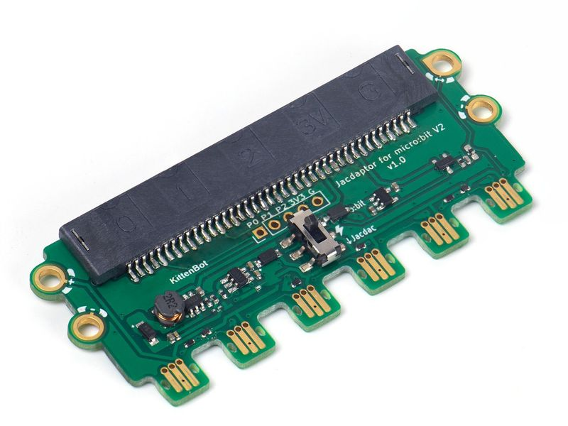
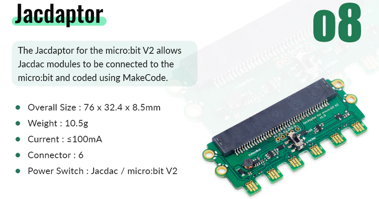
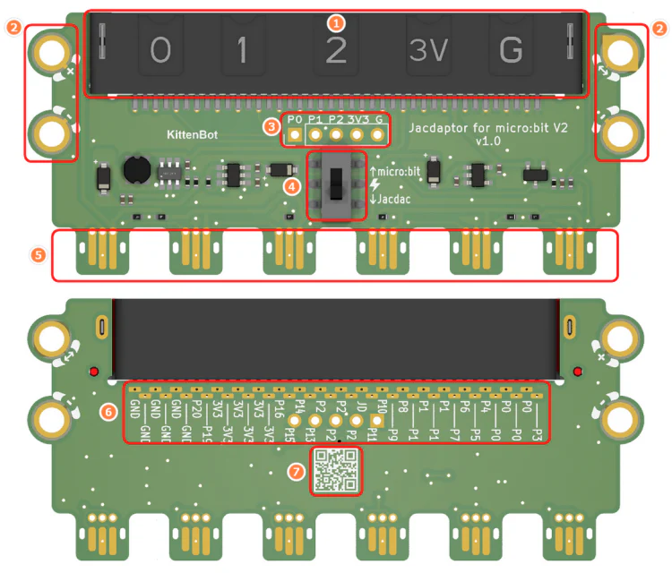
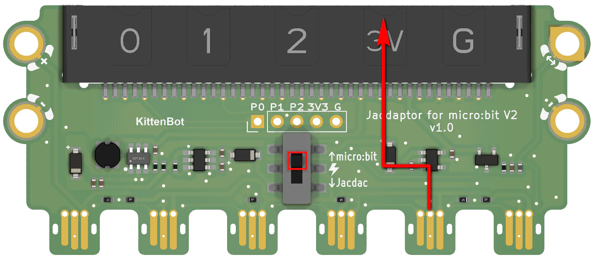
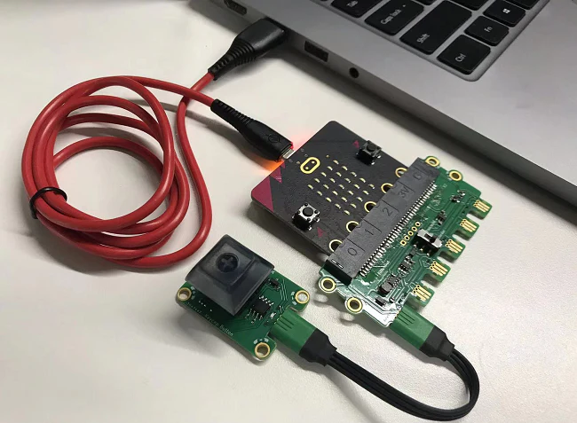

# Jacdapter for Micro:bit V2

Jacdapter is the extension board for Micro:bit V2 that provides 6 Jacdac ports for Micro:bit V2.

## Product Specifications

## Product Details

1. Micro:bit Slot
2. Jacdac Standard Through Holes
3. Micro:bit Pin Connectors
4. Power Switch
5. Jacdac Connectors
6. Micro:bit Pins(For Soldering)
7. Product QR Code

## Using the Power Switch

When the switch is flipped down, power is supplied to the Jacdac modules from the Micro:bit.

When the switch is flipped up, power is supplied from the Jacdac modules to the Micro:bit.

## Tutorial

### Insert a Micro:bit V2 onto the slot

