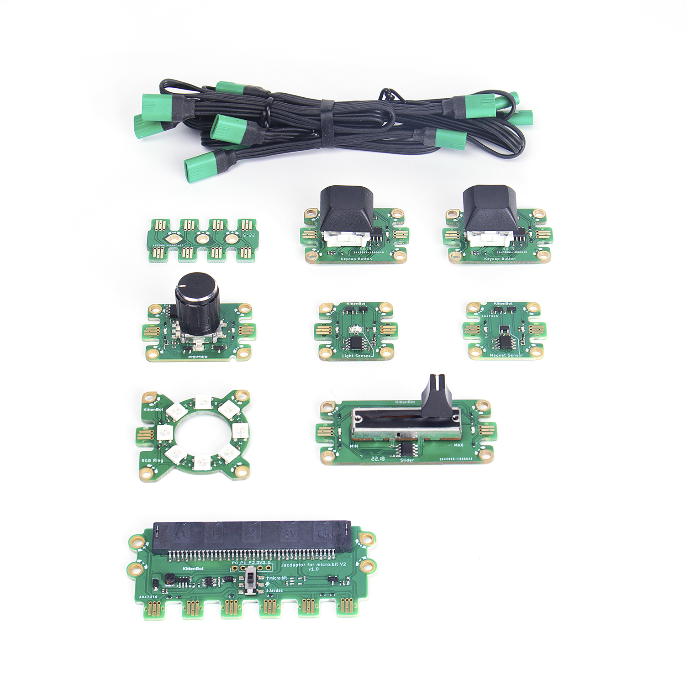
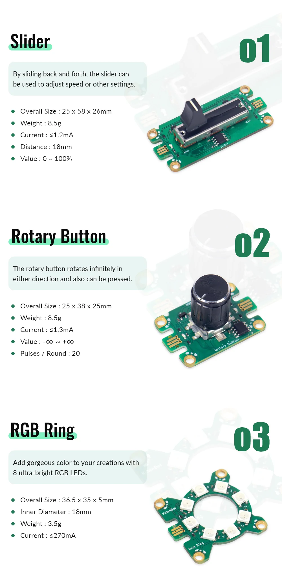
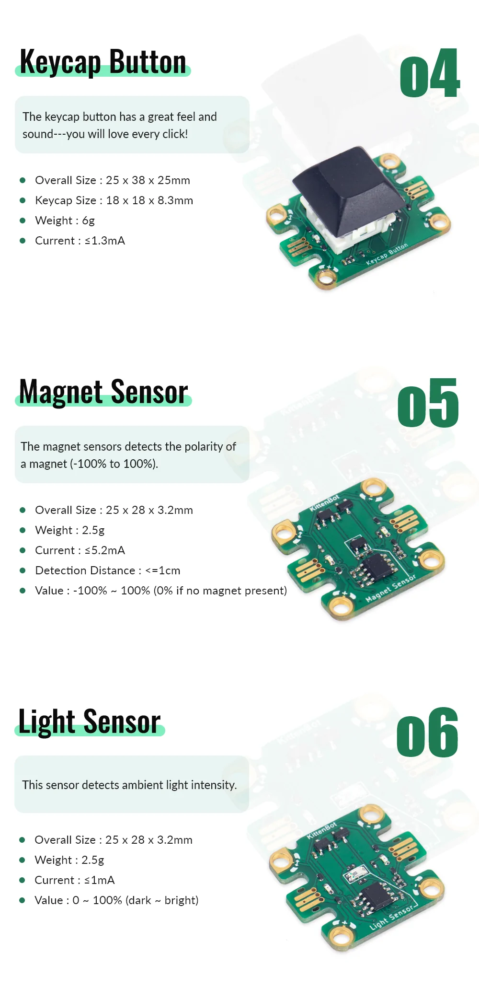
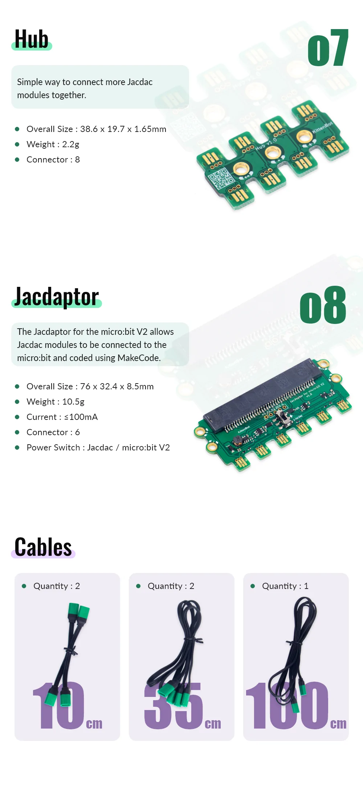

# KittenBot JacDac Starter Kit

Kittenbot has launched the first Jacdac kit in the market, this starter kit includes the Jacdapter for Micro:bit V2 as well as various sensor modules to kickstart JacDac programming.

## Kit Contents

1. Jacdapter *1
2. Jacdac Keycap Button Module *2
3. Jacdac Rotary Button Module *1
4. Jacdac Slider *1
5. Jacdac Light Sensor Module *1
6. Jacdac Magnetic Sensor Module *1
7. Jacdac RGB LED Ring *1
8. Jacdac Hub Splitter *1
8. Jacdac Connection Cables *5

