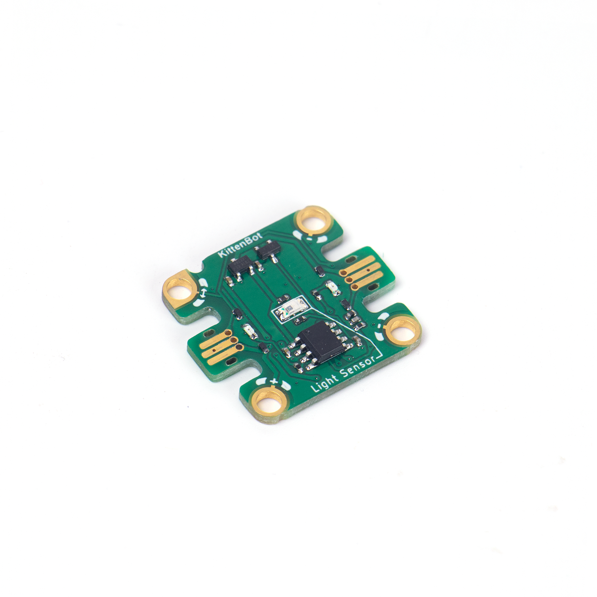
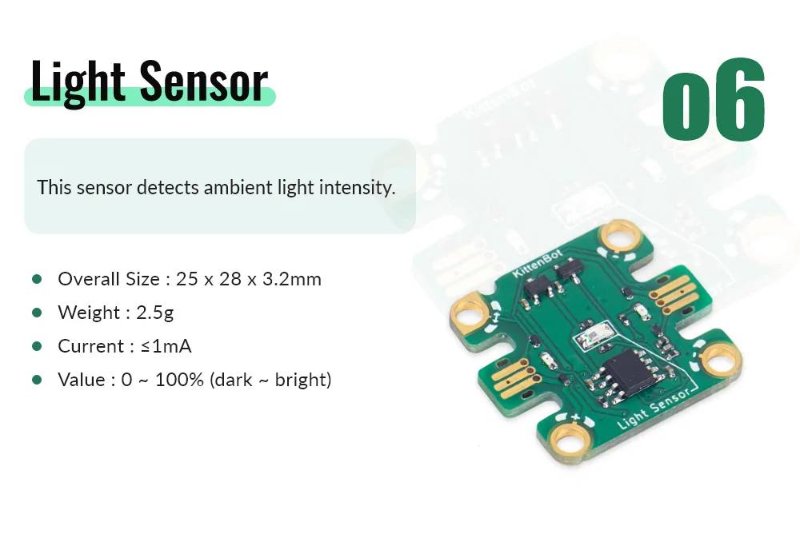
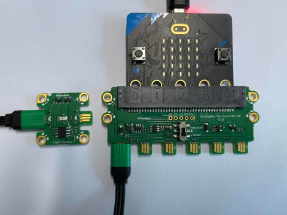
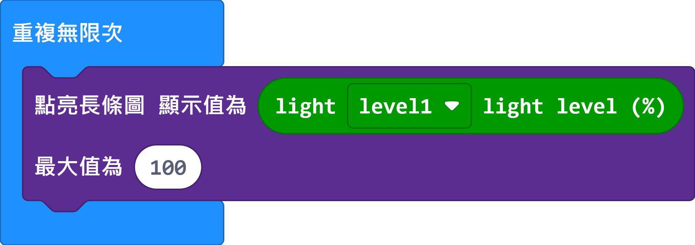

# Jacdac Light Sensor Module

This light sensor can sense the ambient light level.

## Product Specifications

## Sample Wiring

## MakeCode Programming Tutorial

### Sample Program

Micro:bit graph will change according to the light level.

[Sample Program](https://makecode.microbit.org/_JvbLuaDxr5Pp)