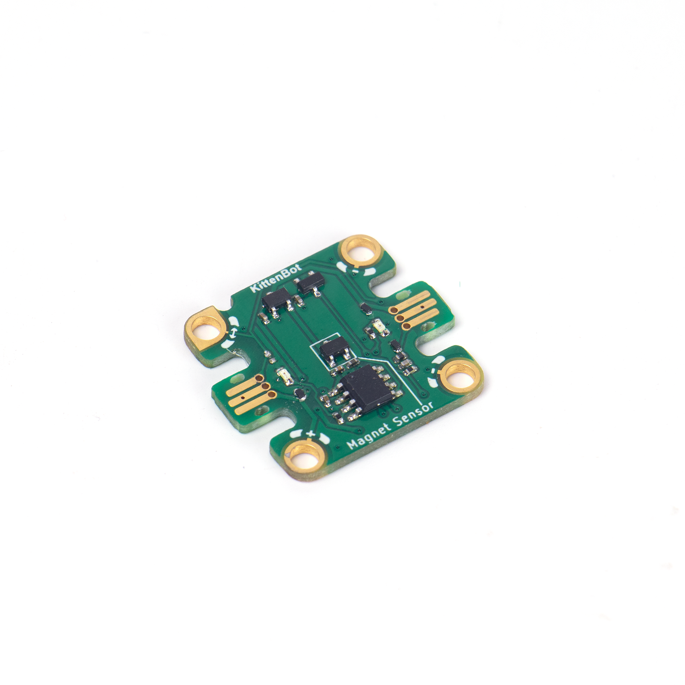
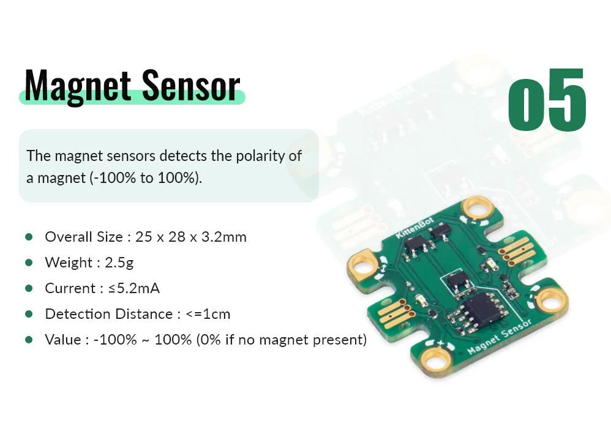
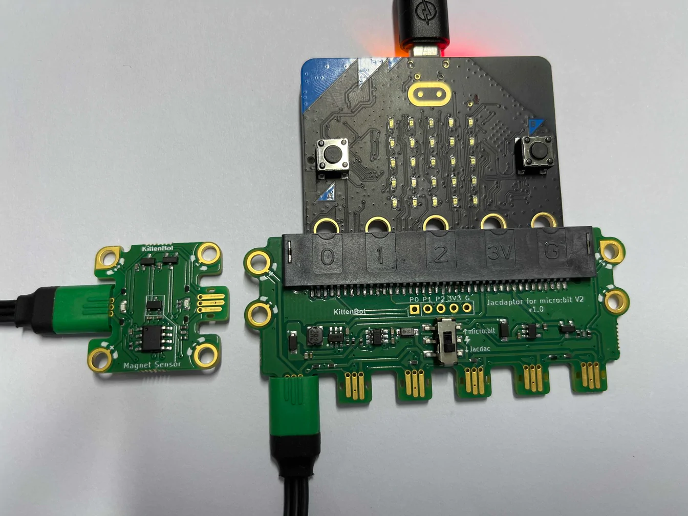
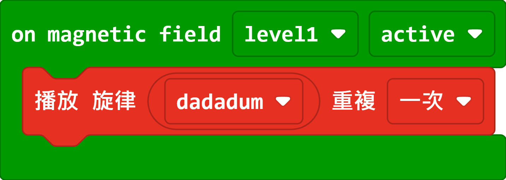

# Jacdac Magnetic Sensor Module

This magnetic sensor can sense the strength and polarity of the magnet.

## Product Specifications

## Sample Wiring

## MakeCode Programming Tutorial

### Sample Program

The Micro:bit will play a melody when a magnet is present.

[Sample Program](https://makecode.microbit.org/_4s2VREa3eXhc)