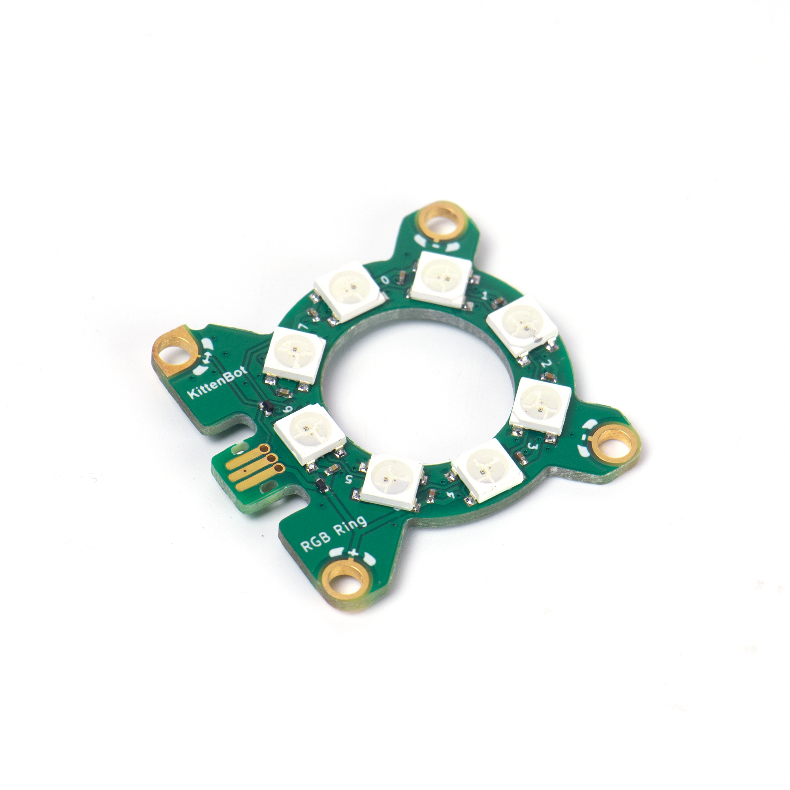
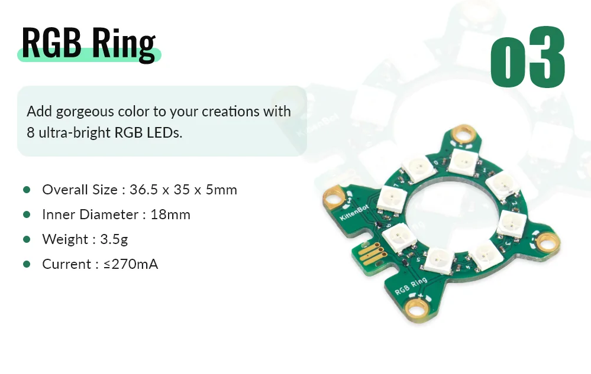
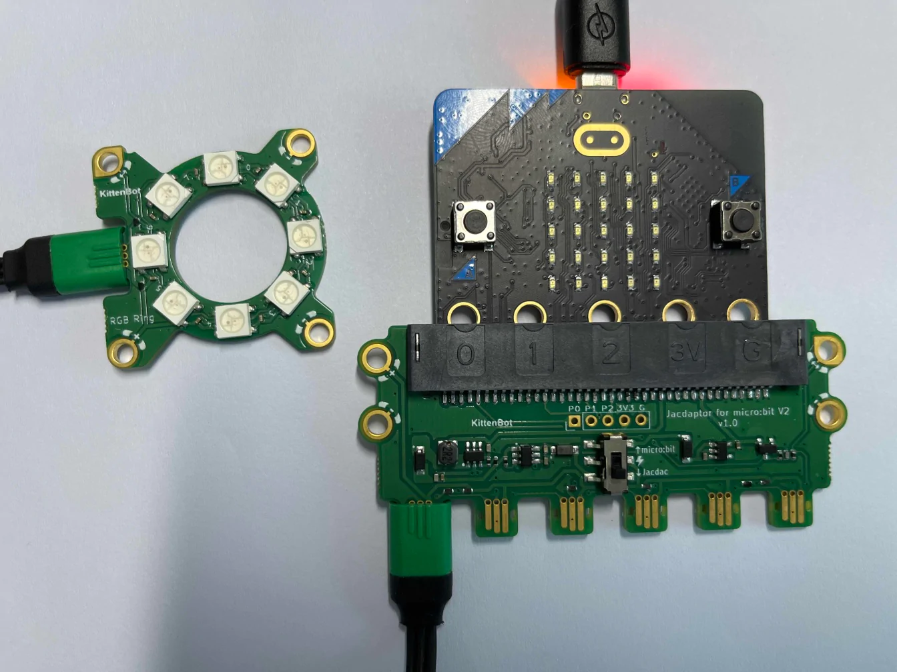

# Jacdac RGB LED Ring

RGB LED ring that can displays RGB colors.

## Product Specifications

## Sample Wiring

## MakeCode Programming Tutorial

### Sample Program

The number of LEDs lit up corresponds to the loudness value.

[Sample Program](https://makecode.microbit.org/_cVi3C5hrM3sx)