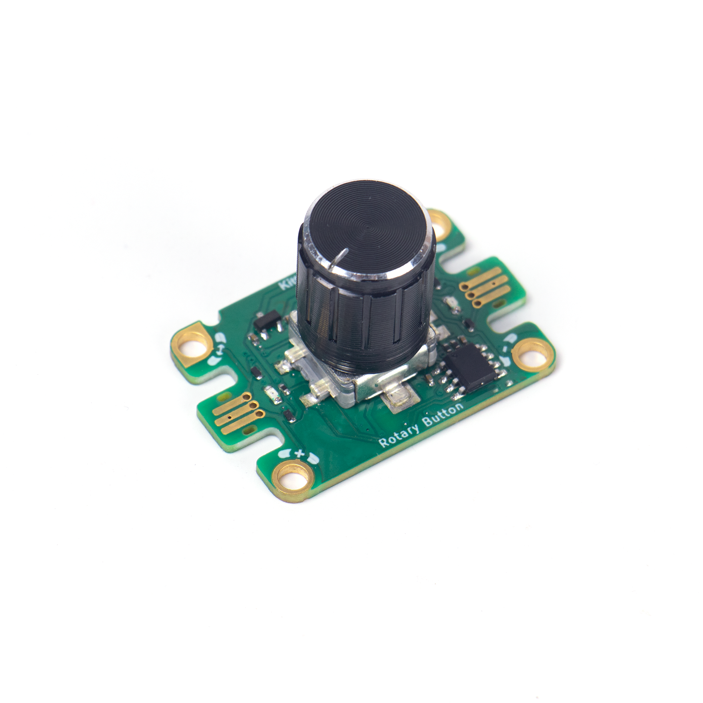
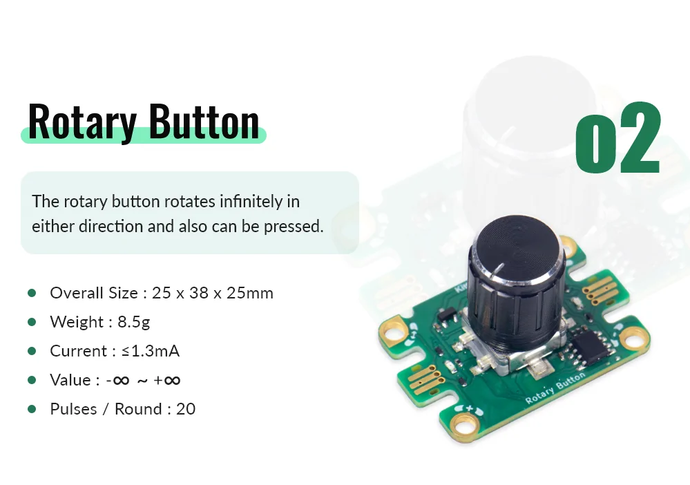
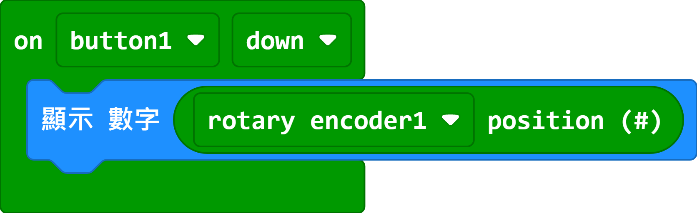

# Jacdac Rotary Button Module

This module has 2 functions. Firstly, it has a limitless rotary encoder, meaning the value range is infinite. It can also act as a button when pressed down.

## Product Specifications

## Sample Wiring

## MakeCode Programming Tutorial

### Sample Program

Micro:bit displays the rotary value when the button is pressed.

[Sample Program](https://makecode.microbit.org/_W0aJ6eaJtdyo)