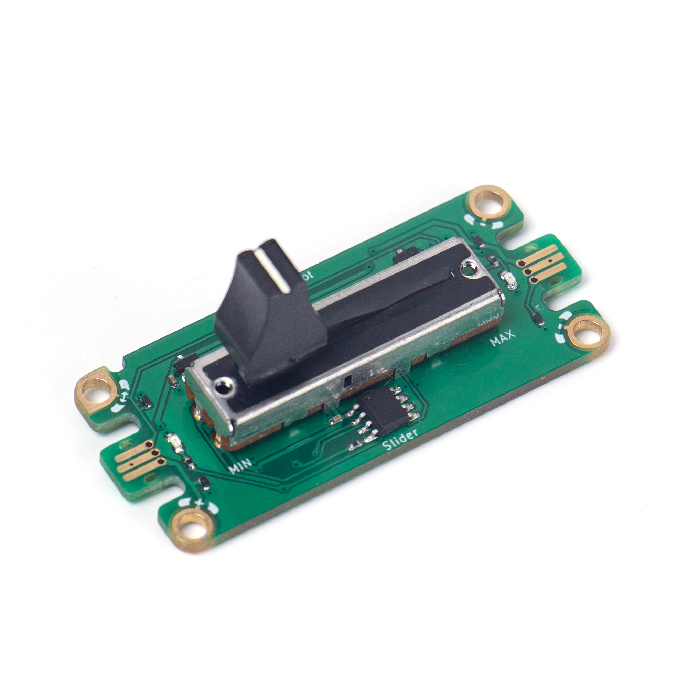
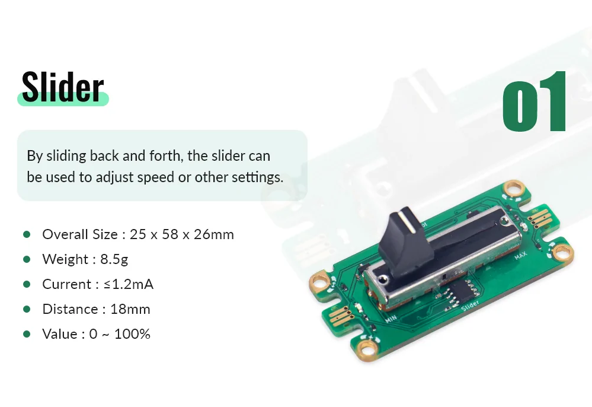
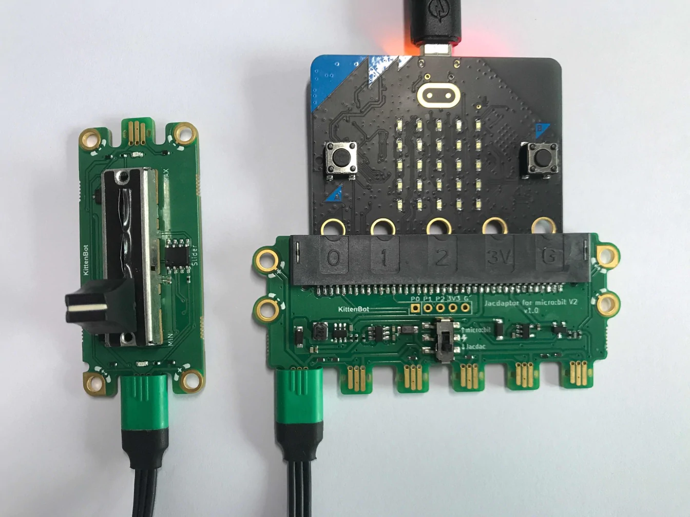

# Jacdac Slider Module

This is a slider potentiometer, its value can be controlled by moving the slider.

## Product Specifications

## Sample Wiring

## MakeCode Programming Tutorial

### Sample Program

Use the slider to control the Micro:bit graph.

[Sample Program](https://makecode.microbit.org/_MFx3iTJtdbdW)