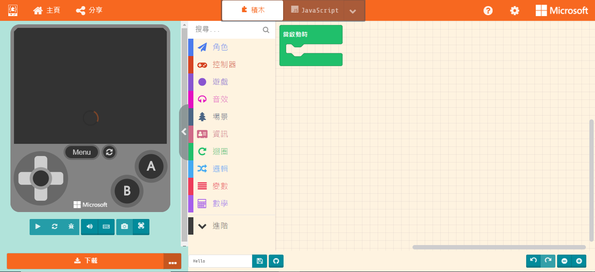

# Meowbit MakeCode Coding QuickStart

MakeCode Arcade is a programming platform for making games developed by Microsoft, it is also the main programming platform for Meowbit.

#### Meowbit has been officially approved by Microsoft for MakeCode Arcade.

## MakeCode Arcade Coding

### Connect your Meowbit to the computer.

### Enter Upload Mode

- Hold A and power on.

A device called Arcade-F4 would appear on your computer.

### Open Makecode Arcade

### <https://arcade.makecode.com>

### Create a Project

### Coding Interface

### Select Meowbit from Hardware Menu

### Code your game

    This program is for demonstration only.

### Download the game onto your Meowbit.

