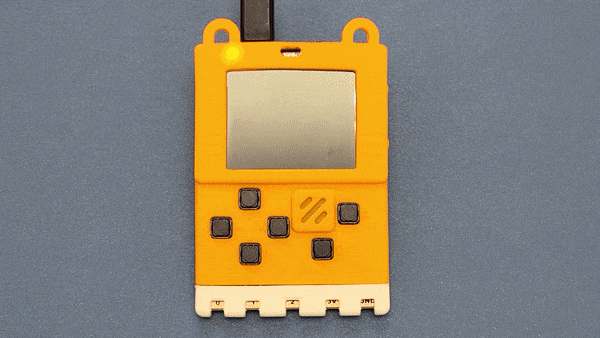
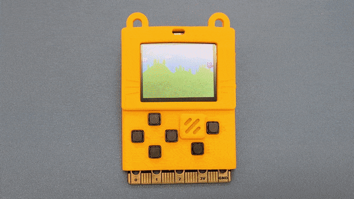
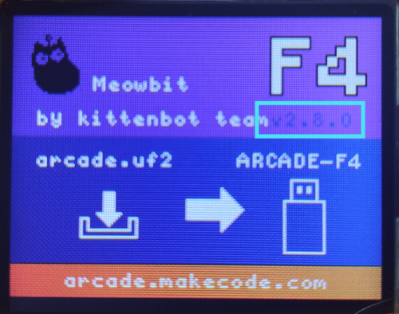
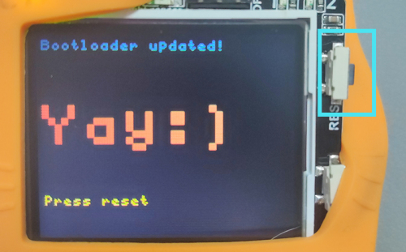

# MeowBit System Operations

This page will explain how to use the system operations on the MeowBit, including entering uploading mode, opening options or firmware updates.

## Entering Upload Mode

Only in Upload Mode can the games be uploaded to MeowBit.

### Method 1

Connect the MeowBit to a computer using an USB Cable.

Hold the A button on the MeowBit and switch the power on.

The Meowbit is in Upload Mode when this screen is shown.

### Method 2

Connect the MeowBit to a computer using an USB Cable.

Switch the power on.

Hold the A button and press the reset button.

The Meowbit is in Upload Mode when this screen is shown.

## Opening Options Menu

We can open up the settings menu to change settings such as screen brightness or volume.

### Method 1

Press the Options button.

Use the D-Pad to select different settings and use button A to confirm.

## Updating the Firmware

[Firmware v2.8.0 Download](www.google.com)

Enter Upload Mode first.

Put the files onto the device called Arcade-F4.
After updating, press the reset button to finish the update.

