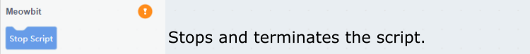
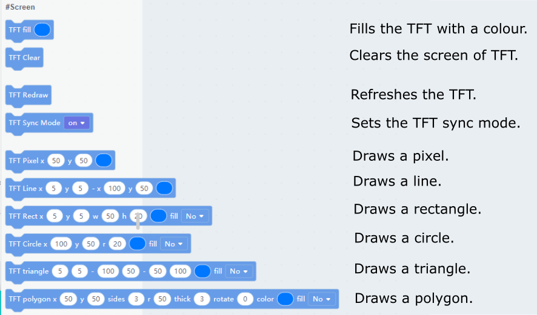
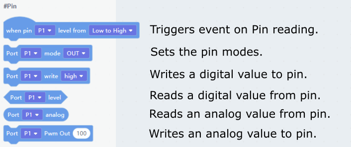

# Meowbit Kittenblock Coding Quickstart

Kittenblock is a programming platform designed for teenagers, it is another major programming platform for Meowbit.

## Connect Meowbit to Kittenblock

Establishing a connection between Meowbit and Kittenblock is required to program Meowbit from Kittenblock.

### 1. Connect Meowbit to computer and enter upload mode.

- Hold button A and turn on the power.

A device called Arcade-F4 would appear.

### 2. Open Kittenblock and select Meowbit from the Hardware Menu.

### 3. Flash the firmware.

A device called PYBFLASH would appear.

    If the device is called USB Drive, hold down B and press reset.

### 4. Click the Exclamation Mark Icon and click Connect.

A string will be displayed on Meowbit to notify it is connected to Kittenblock.

## Kittenblock Coding Tutorial

### Scripts

### Inputs and Sensors

### Display

### Buzzer

### IO Pins

### Robotbit

### Neopixel

### Turtle

### Serial Communication

