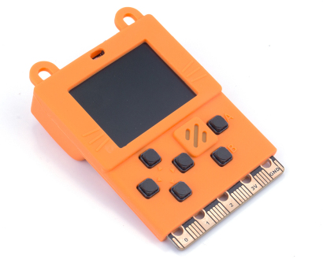
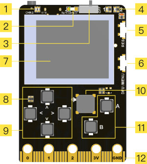
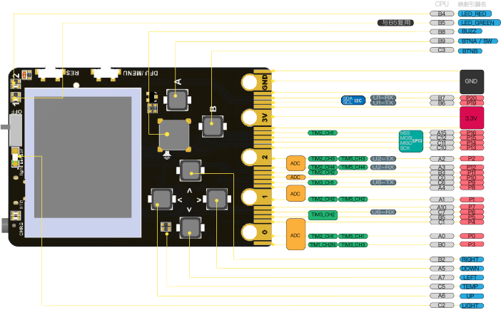
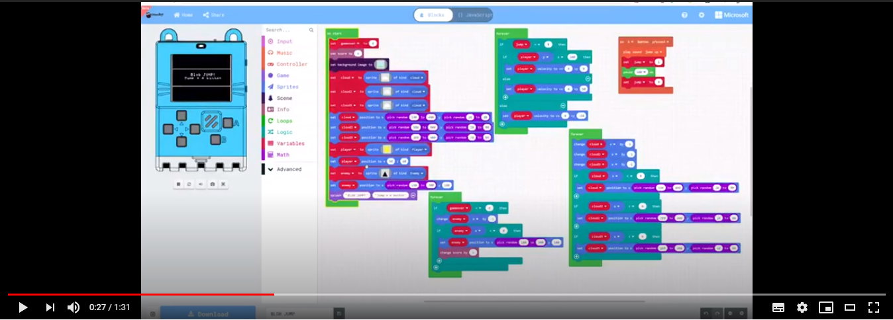
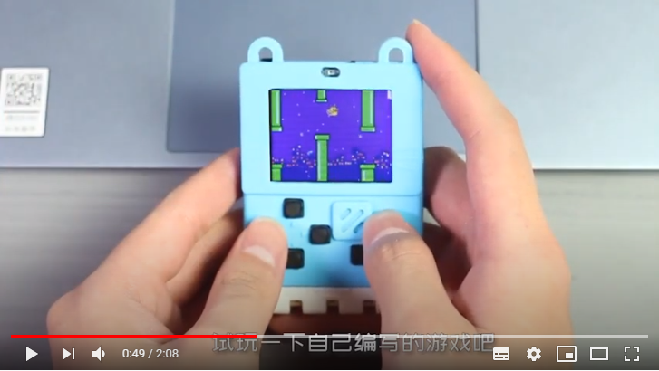

# Meowbit Introductions

Most teenagers nowadays like playing video games, in order to make them more intereseted in coding, Kittenbot has developed Meowbit, a handheld game console designed for MakeCode Arcade. Students can use MakeCode Arcade to create their own games and then play them on the Meowbit, allowing everyone to experience game design, truly realizing the concept of STEAM education.

In addition, Meowbit can also act as a control board for robots as it has the same edge connectors as the Micro:bit, making it compatible with Kittenbot's expansion boards. Thus, the flexibility and possibilities with Meowbit can be further increased with expansion boards!

### **Meowbit has been officially approved by Microsoft as a recommended board for MakeCode Arcade.**

## Target Audiences

- Schools and Institutes
- Users interested in Game Design

## Special Features

- Supports Graphical Programming, suitable for beginners.
- Combing Coding with Art, realizing concept of STEAM.
- High flexibility, can be used as a game console or as a robot controller.
- Multiple sensors have been built-in, allowing for more possibilities in coding.
- Supports multiple coding platform, including MakeCode Arcade and Kittenblock.
- Nostalgic and adorable graphics.
- Highly portable, allows you to play you games anywhere.
- Supports Chinese Unicode, allowing you to display Chinese characters.

## Specifications

- Dimensions: 52x76x12mm
- Weight: 42g
- CPU: STM32F401RET6,32-bit ARM Cortex M4
- Power Inpit: 5V USB, 3.7~4.2V Battery Box
- Screen: TFT Full-Color
- Resolution: 160x128
- Screen Size: 1.8 inches
- IO Pins: 20PIN(Same as Microbit)

## Onboard Devices:

- Programmable Buttons x6
- Buzzer x1
- Programmable LEDs x2
- Light Intensity Sensor x1
- Temperature Sensor x1
- Accelerometer x1
- SD Card Slotx1
- JacDac Connectorx1

## Breakdown Diagram

**1: Power Indicator**  

**2: Light Sensor**  

**3: Power Switch**  

**4: Programmable LEDs x2** 
 
**5: Reset Button** 
 
**6: DFU/Menu Button**
  
**7: TFT Screen**  

**8: Temperature Sensor** 
 
**9: Programmable D-Pad**
  
**10: Programmable Buzzer** 
 
**11： Programmable A and B Buttons**  

**12: Edge Connectors**  

**13：USB Port** 
 
**14：SD Card Slot** 
 
**15：JacDac Connector**  

**16: 6-Axis Accelerometer**  

**17：3.7V Battery JST Connector** 
 
**18: Main Chip**
  
**19: Unicode Chipset**  

**20: Name Plate**  

## Supported Programming Platforms:

- Microsoft MakeCode Arcade
- Kittenblock

## Detailed Pinouts:

## Videos:

### Meowbit Introduction:

### Sharing by Overseas User:

### Meowbit Usage Sharing:

