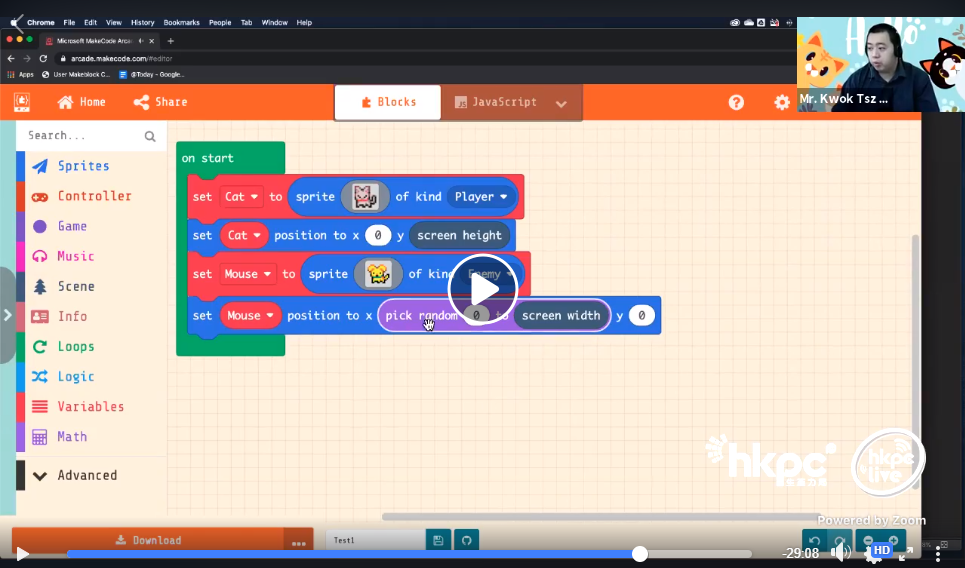
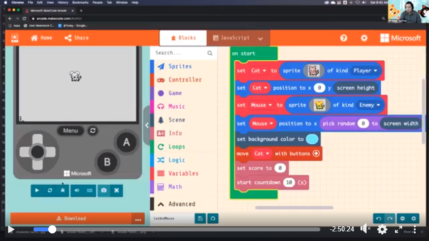

# MeowBit HourOfCode Tutorials

We are delighted to have the permission of Mr. Kwok from Tin Ka Ping Secondary School to show his tutorials of making games on MakeCode Arcade.

In this 2-session tutorial, you will learn to create your own game from scratch.

[MakeCode Arcade](https://arcade.makecode.com/)

## Your First Meowbit Game (Video is in Chinese)

### Please start watching from the 118 minutes mark, the session lasts approximately 1 hour.

## Your Second Meowbit Game (Video is in Chinese)

### The session lasts approximately 1 hour.

## Credits

Mr. Kwok's Classroom：

<https://www.facebook.com/kwoksirclassroom/>

Hong Kong InnoSpace HourOfCode：

<https://www.facebook.com/watch/107807216571940/728249611306184>

