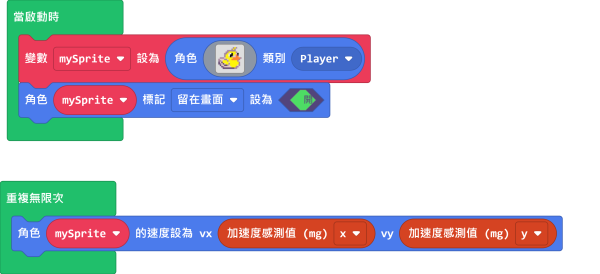
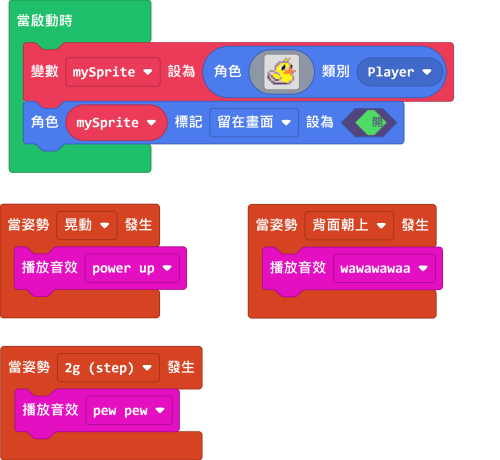
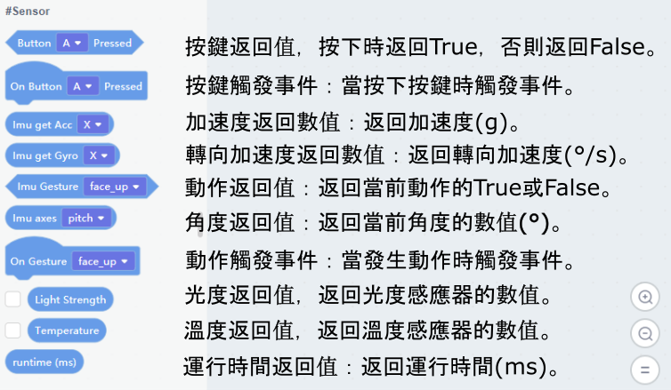
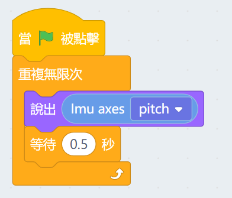
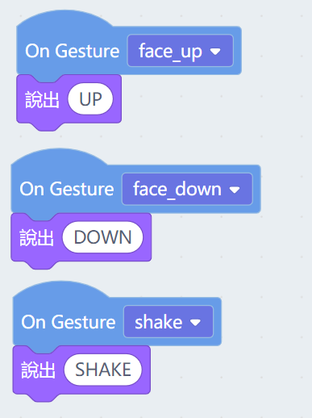
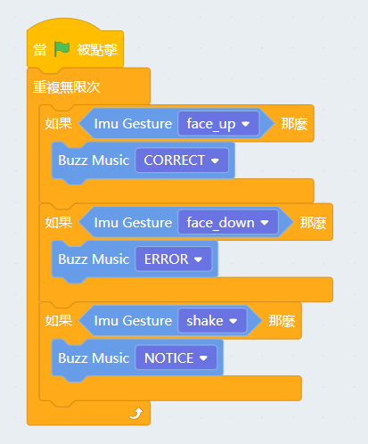

# Meowbit's Accelerometer

Meowbit has a built-in accelerometer for measuring rotation and acceleration of the device, as well as detecting different gestures.

## MakeCode Arcade Coding Tutorial

### Load Controller Extension

### [Loading Extensions](../Makecode/powerBrickMC)

### Blocks for Controller Extension

### Detecting rotation

    The rotation value ranges from 0 to 1023.

[Sample Code Link](https://makecode.com/_5UrbHAFAFD2K)

### Detecting gestures

[Sample Code Link](https://makecode.com/_Pc0AufXvC6DD)

##  Kittenblock Coding Tutorial

### Blocks for the accelerometer

### Getting the acceleration

### Getting the rotational acceleration

### Getting the tilting degree

### Detecting gestures

The gestures can be detected in 2 ways.

