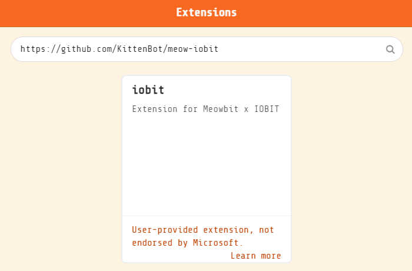
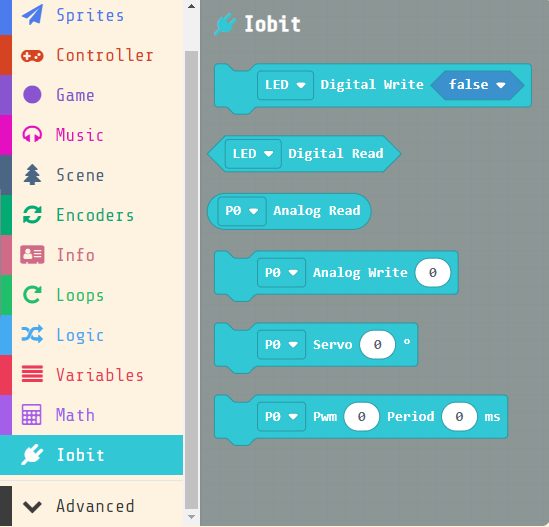
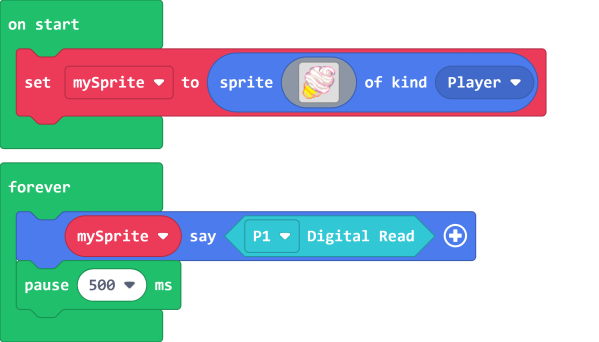
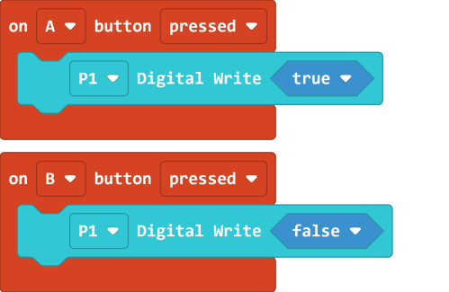
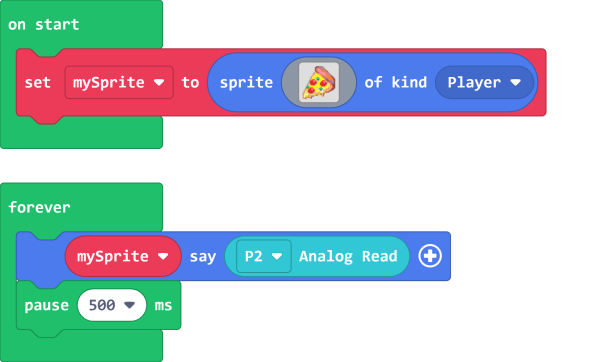
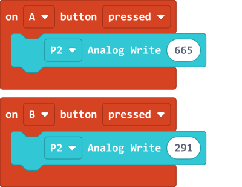
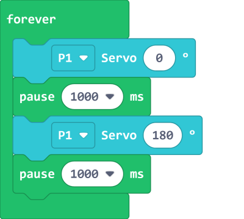

# Meowbit & IOBit

Meowbit can be used in conjunction with an IOBit to achieve even more possibilities.

## MakeCode Arcade Coding Tutorial

## Using IOBit and IO Pins

### Load IOBit Extension

IOBit Extension: https://github.com/KittenBot/meow-iobit

### [Loading Extensions](../Makecode/powerBrickMC)

### Blocks for controlling IOBit

### 1. Reading and Writing Values

#### 1.1 Read digital values

[Sample Code Link](https://makecode.com/_fD2EzsE3JVPJ)

#### 1.2 Write digital values

[Sample Code Link](https://makecode.com/_0Eq1XdHzWXJq)

#### 1.3 Reading analog values

[Sample Code Link](https://makecode.com/_cujbCAPbE5Hx)

#### 1.4 Writing analog values

[Sample Code Link](https://makecode.com/_2ovaa74358EC)

### 2. Controlling servos

[Sample Code Link](https://makecode.com/_iA0YjiR3sJFz)