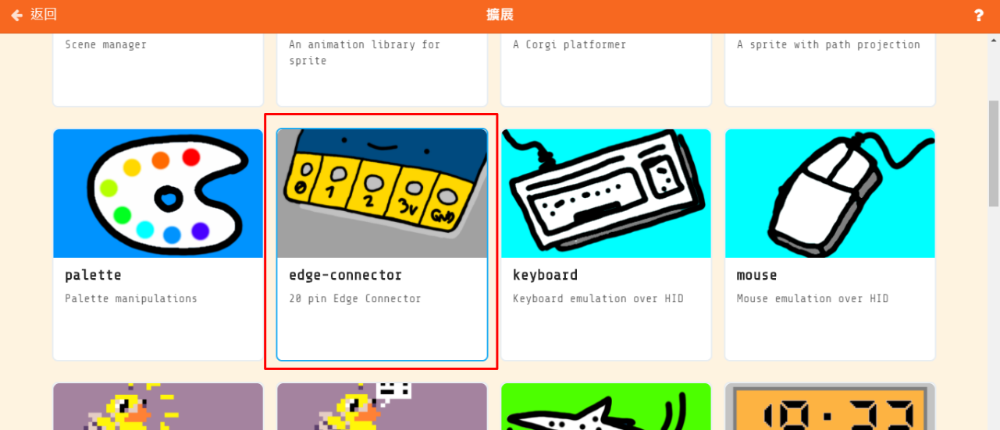
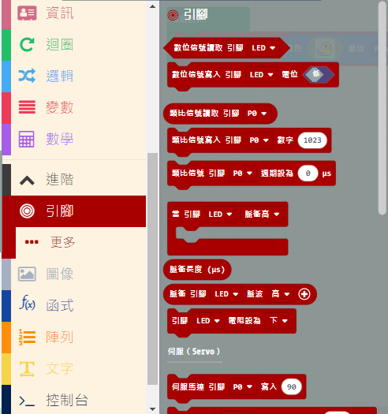
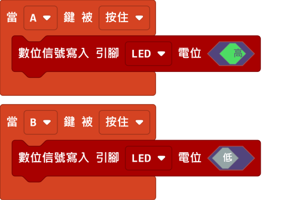
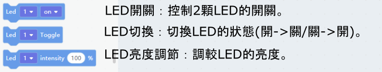
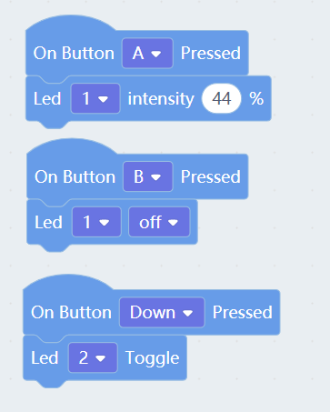

# Meowbit's LED

Programmable LEDs are built onto Meowbit.

## MakeCode Arcade Coding Tutorial

### Load IO Pin Extension

### [Loading Extensions](../Makecode/powerBrickMC)

### Blocks for IO Pins

### Using the LED

[Sample Code Link](https://makecode.com/_FHs7jp8L3erd)

##  Kittenblock Coding Tutorial

### Blocks for LEDs

### Using the LED

