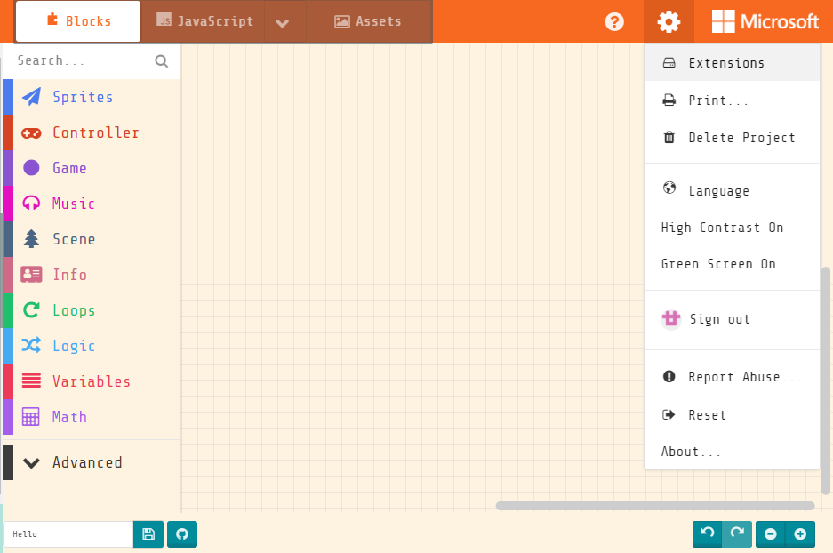
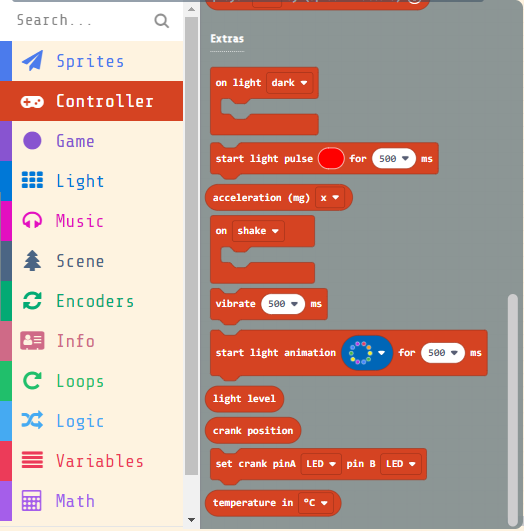

# MeowBit's Light Sensor

Meowbit has a built-in light intensity sensor, allowing it to detect environment brightness.

## MakeCode Arcade Coding Tutorial

### Load Controller Extension

### [Loading Extensions](../Makecode/powerBrickMC)

### Blocks for Controller Extension

### Detecting Brightness

[Sample Code Link](https://makecode.com/_EUyfs590PdhJ)

### Detecting Light Intensity

    The light intensity has a range from 0 to 255.

[Sample Code Link](https://makecode.com/_VbYeA6apKPd0)

##  Kittenblock Coding Tutorial

### Detecting Light Intensity

