# Meowbit & Neopixel

Meowbit can also be programmed to control Neopixel LED strips, such as the one on Robotbit.

## MakeCode Arcade Coding Tutorial

## Controlling LED strip

### Load Light Extension

### [Loading Extensions](../Makecode/powerBrickMC)

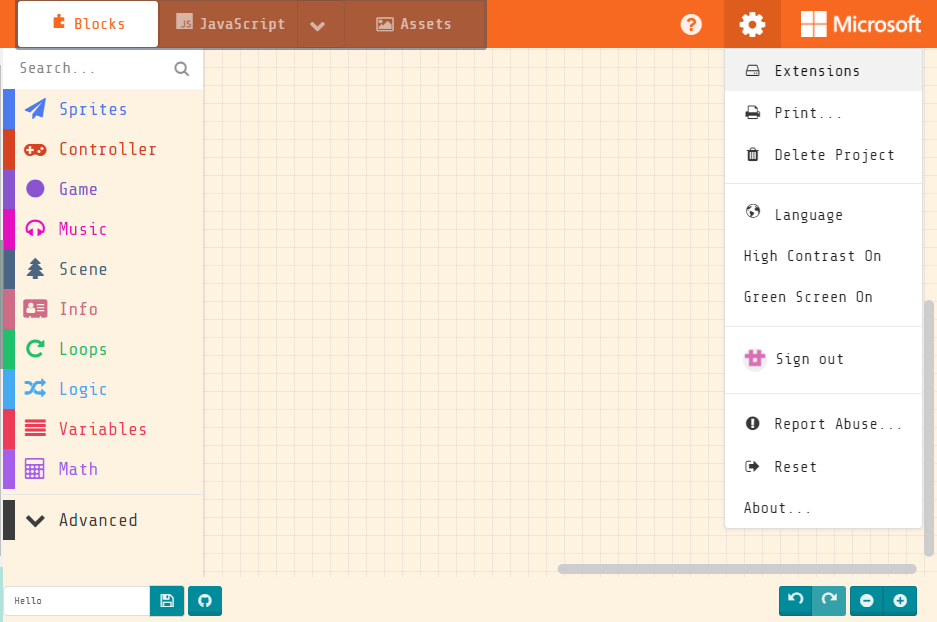

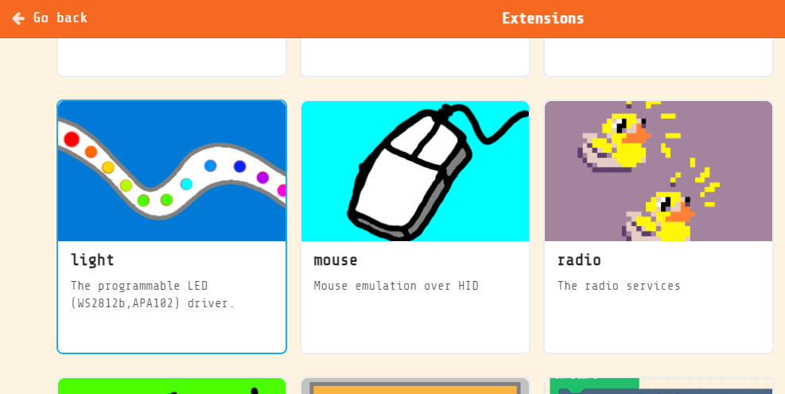

### Blocks for controlling LED strips

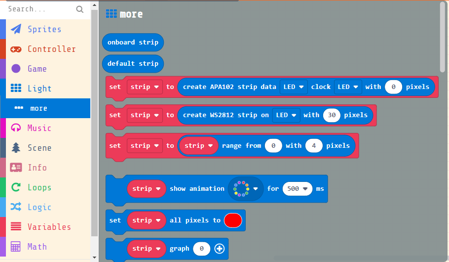

### Programming LED strip of the Robotbit

    The LED strip on the Robotbit is connected to P16.
    
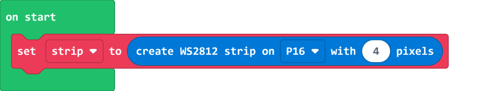
    
#### Lighting up all 4 LEDs

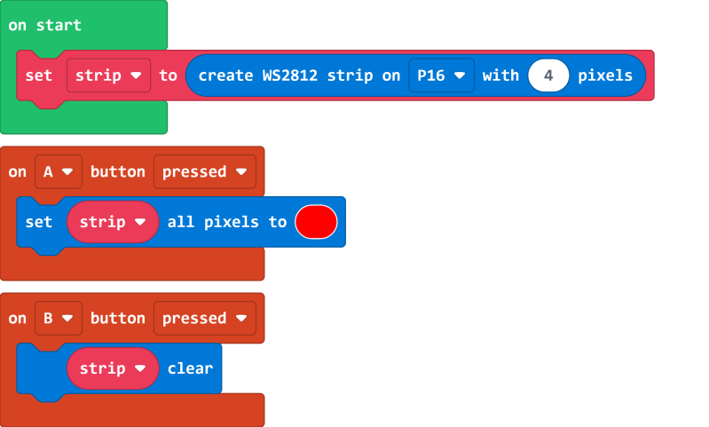

[Sample Code Link](https://makecode.com/_XXwcLH7YpW2x)

#### RGB color

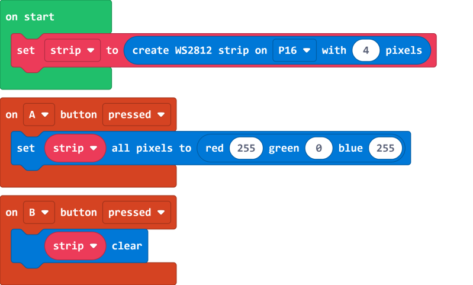

[Sample Code Link](https://makecode.com/_CTVgMgevD2Ks)

#### HSL color

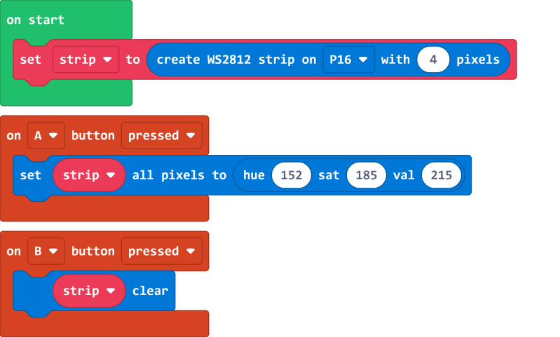

[Sample Code Link](https://makecode.com/_M6M9VrHbj8dH)

#### Controlling individual lights

    The index of the LED lights starts from 0.

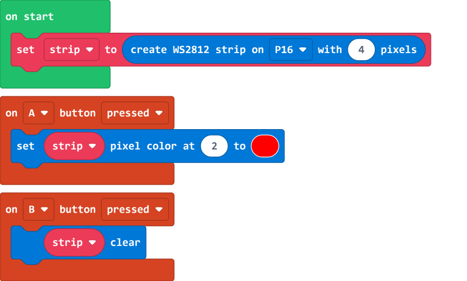

[Sample Code Link](https://makecode.com/_89Hb2TW6LJ0a)

#### Photon effect

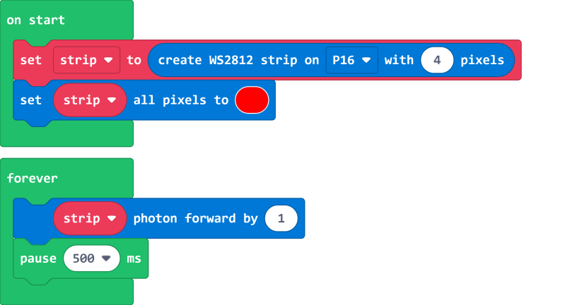

[Sample Code Link](https://makecode.com/_92m20h91uL5j)

##  Kittenblock Coding Tutorial

### Programming the LED strip of the Robotbit

    The LED strip of the Robotbit is connected to P16.

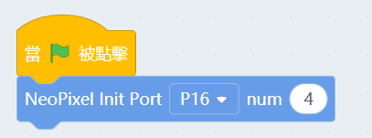

#### Lighting up all LEDs

    All effects will only be shown after using Color Update block.

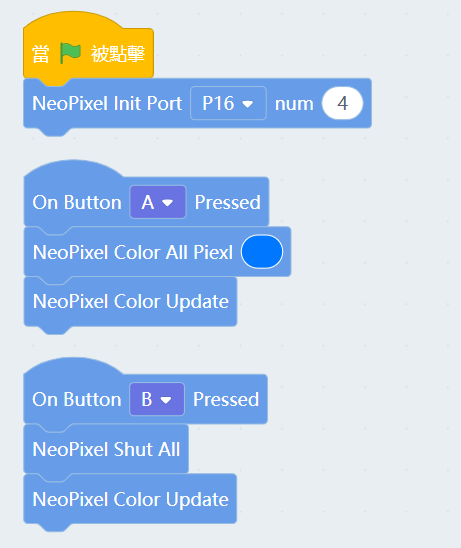

#### RGB color

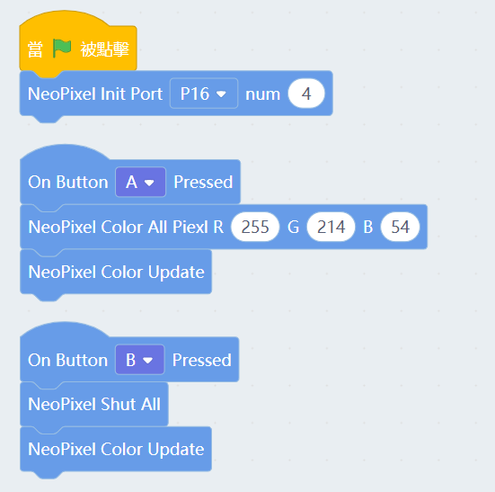

#### Controlling Individual Lights

    The index of the LED lights starts from 0.

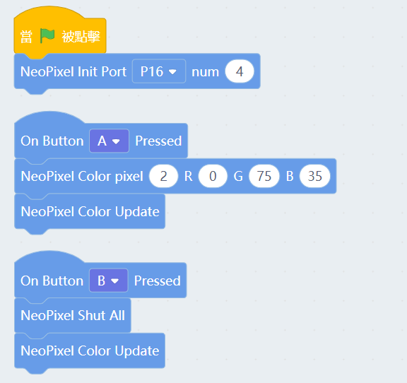