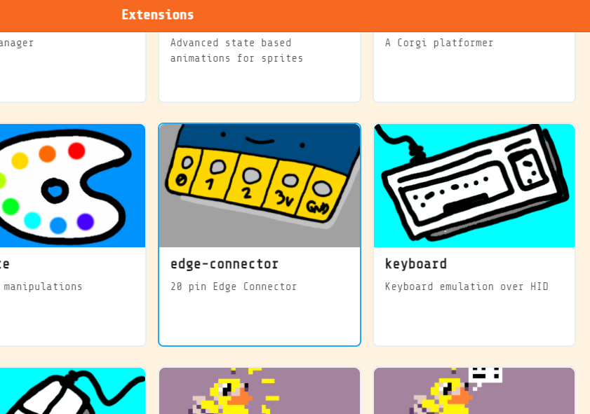
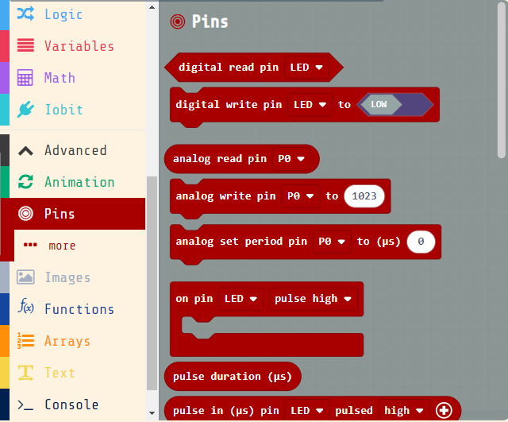
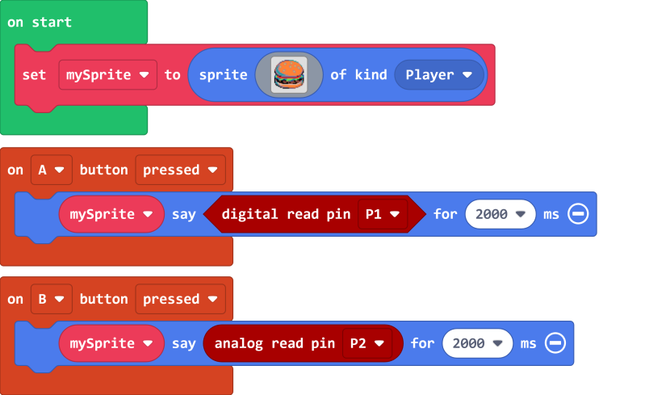
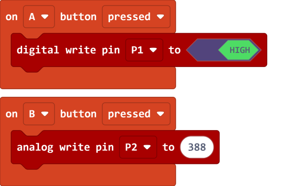
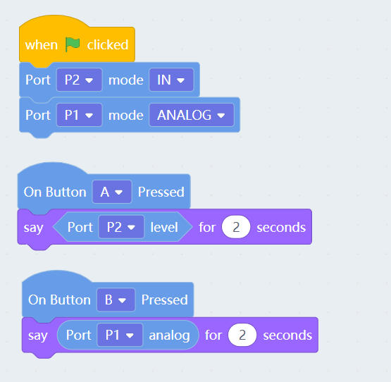
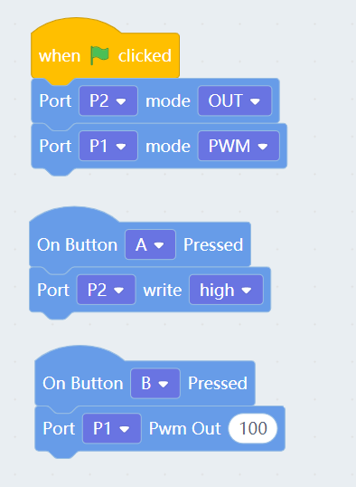

# Meowbit's IO Pins

Meowbit has the same 20 IO Pins as the Micro:bit, you can connect different modules to use on the Meowbit.

## MakeCode Arcade Coding Tutorial

### Load IO Pin Extension

### [Loading Extensions](../Makecode/powerBrickMC)

### Blocks for IO Pins

    Loading the extension for Robotbit would automatically load the extension for IO pins.

### Using the IO Pins

#### Reading values

[Sample Code Link](https://makecode.com/_7ubaidLXoJai)

#### Writing Values

[Sample Code Link](https://makecode.com/_46pdR89CkTD5)

##  Kittenblock Coding Tutorial

### Blocks for IO Pins

#### Reading values

#### Writing Values

