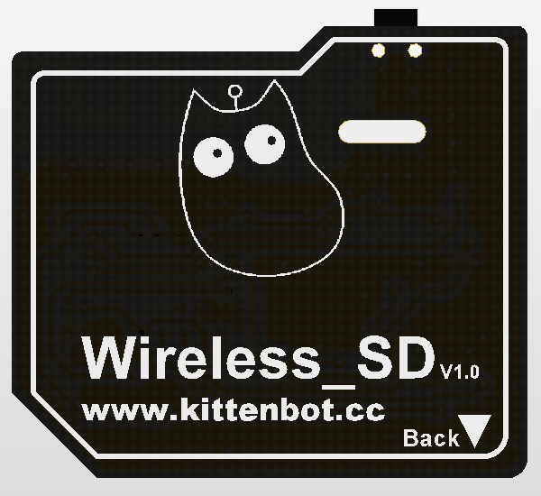
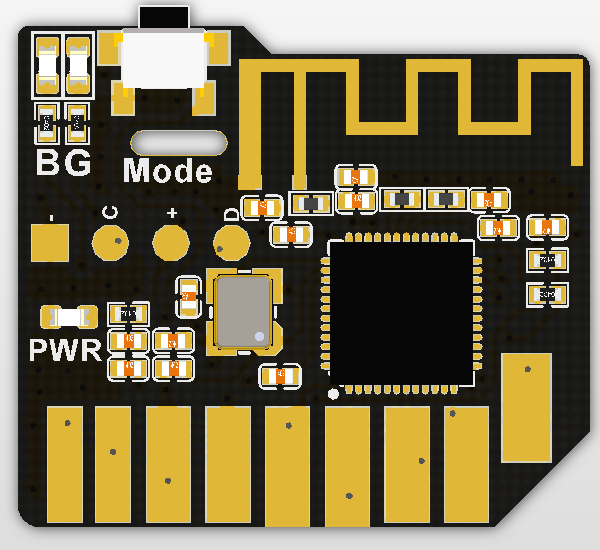
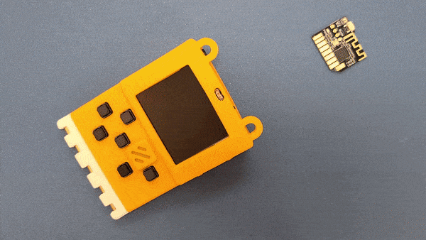
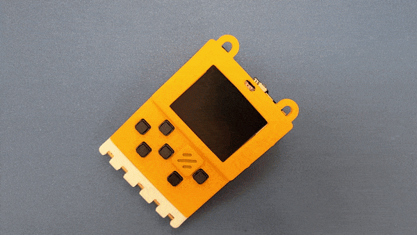
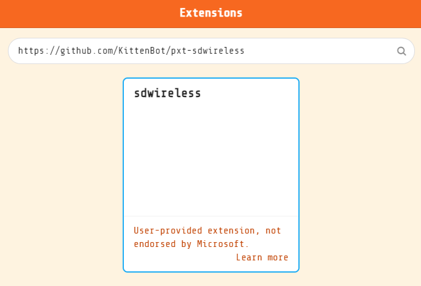
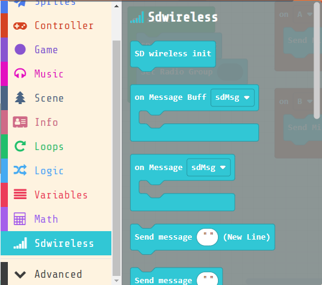
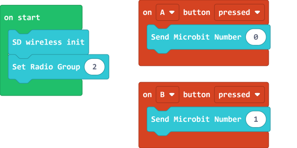
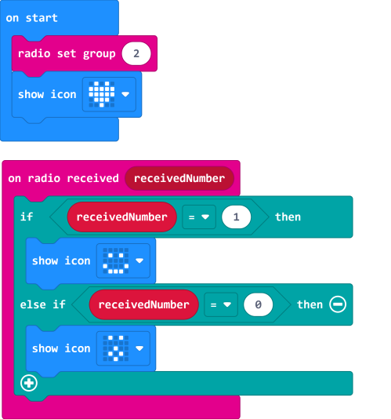
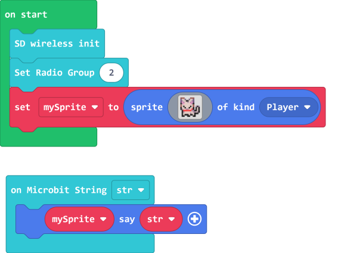
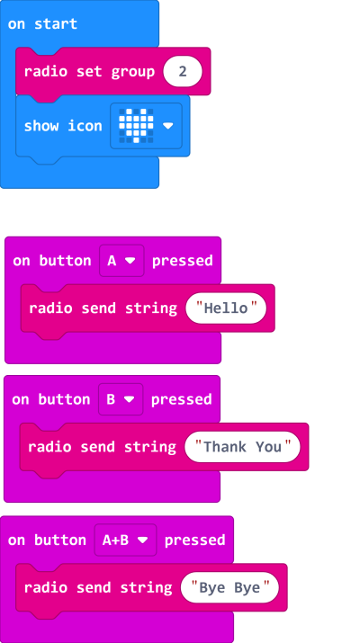

# MeowBit Wireless SD Module

With the Wireless SD Module, we can use Meowbit to communicate with other devices such as Micro:bit.

## Specifications

- Chipset: nRF51822 ARM Cortex-M0
- Frequency: 16Mhz
- Dimensions: 24x21X3mm
- Weight: 14g
- Max distance: 10m
- Working Voltage: 3.3V
- Protocols: Wireless 2.4GHz, Bluetooth 2.4G
- Wireless Mode Indicator (Green for 2.4GHz, Blue for Bluetooth)
- Mode Toggle Switch
- Compatible with SD Card slot

## Installation Method

Installation: Insert the module into the SD Card Slot of Meowbit with the golden connectors facing towards you.

Removal: Slowly and carefully pull out the module from the slot.

## Mode Toggle

The button on the top of the module is for switching between modes.

## MakeCode Arcade Coding Tutorial

### Load the extension for the wireless module

Wireless Extension: https://github.com/KittenBot/pxt-sdwireless

### [Loading Extensions](../Makecode/powerBrickMC)

### Blocks for the wireless module

### MakeCode Arcade Error Message

    This error message may appear in MakeCode Arcade when using the wireless module, this is simply because the emulator cannot emulate the wireless module.
    Please ignore and continue.

### Sending data

Data can be sent from Meowbit to the Micro:bit using the 2.4GHz radio.

#### Meowbit Coding

[Sample Code Link](https://makecode.com/_CTHU6hP81P6U)

#### Microbit Coding

[Sample Code Link](https://makecode.microbit.org/_R8zKEpixPazc)

#### Pressing A or B on the Meowbit causes Micro:bit to display different icons.

### Receiving data

Meowbit can also receive data from a Micro:bit using the 2.4GHz radio.

#### Meowbit Coding

[Sample Code Link](https://makecode.com/_KDPdA0XccXvP)

#### Microbit Coding

[Sample Code Link](https://makecode.microbit.org/_Xx39ryM2CTp9)

#### Pressing A or B on the Micro:bit causes Meowbit to display different text.

