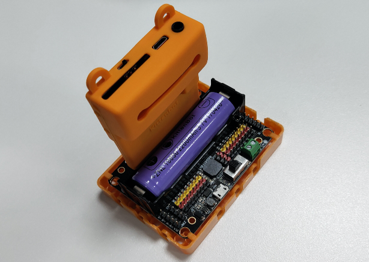
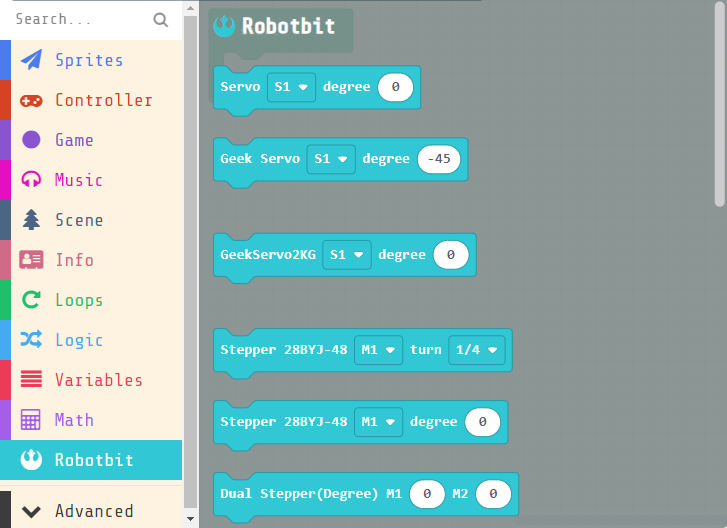
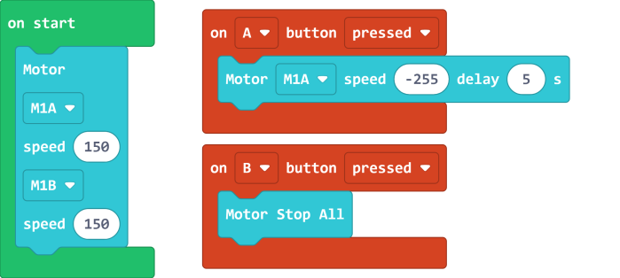
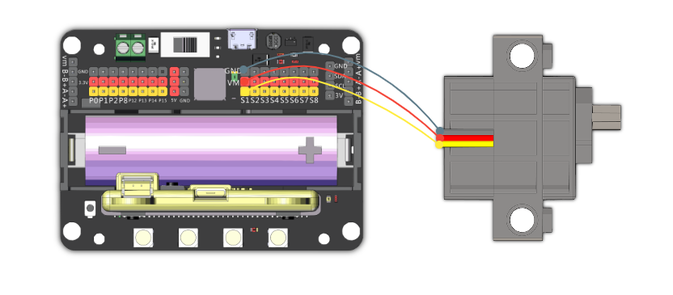
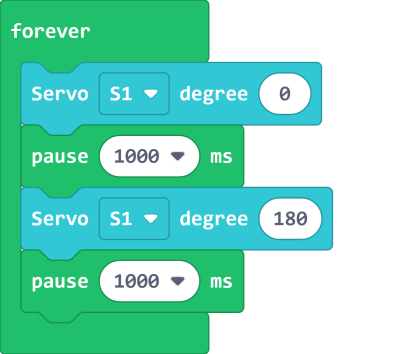
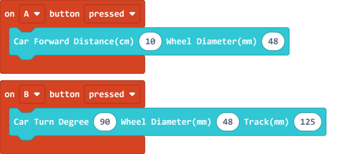
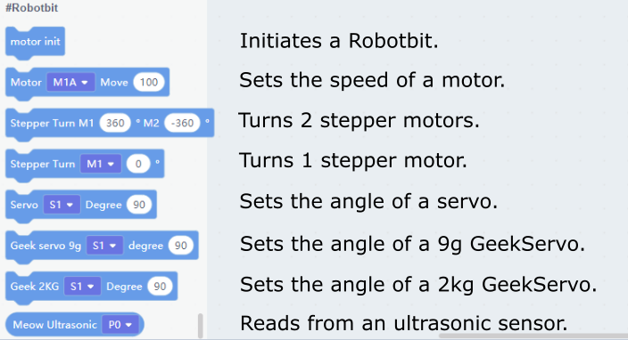
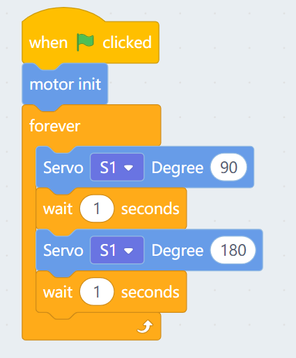
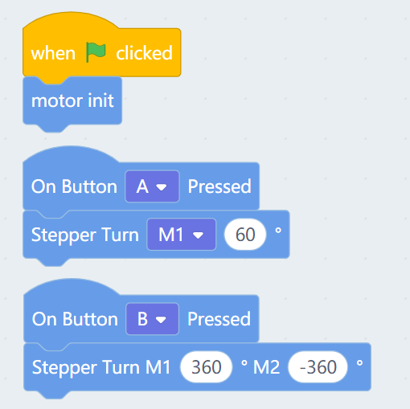
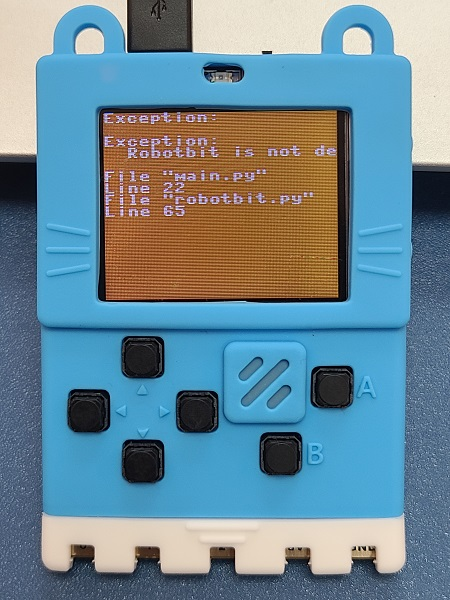

# Meowbit & Robotbit

Meowbit can be used in conjunction with a Robotbit to achieve even more possibilities.

## Robotbit Precautions:

### 1: The battery must be installed in the right way.

### 2: The screen of the Meowbit must be facing outwards.

## MakeCode Arcade Coding Tutorial

## Using Robotbit

### Load Robotbit Extension

### Robotbit Extension: https://github.com/KittenBot/meow-robotbit

### [Loading Extensions](../Makecode/powerBrickMC)

    Loading the extension for Robotbit would automatically load the extension for IO pins.

### Blocks for controlling Robotbit

### Using Meowbit and Robotbit

#### 1. Controlling Motors

Connect DC motors to the motor ports M1A and B of the Robotbit.

[Sample Code Link](https://makecode.com/_PtE25Ke69X5h)

### 2. Controlling Servos

Connect a servo to the servo port S1 of the Robotbit.

[Sample Code Link](https://makecode.com/_FdTVtYRy55kr)

### 3. Controlling Stepper Motors

Connect stepper motors to the motor ports M1 and M2 of the Robotbit, with the red wire connecting to VM.

[Sample Code Link](https://makecode.com/_9hk2UwcvsCAo)

##  Kittenblock Coding Tutorial

### Blocks for controlling Robotbit

#### 1. Controlling Motors

Connect DC motors to the motor ports M1A and B of the Robotbit.

### 2. Controlling Servos

Connect a servo to the servo port S1 of the Robotbit.

### 3. Controlling Stepper Motors

Connect stepper motors to the motor ports M1 and M2 of the Robotbit, with the red wire connecting to VM.

## Troubleshooting

### Q: How to solve the problem of "Robotbit is not defined" error on Meowbit after uploading the program from Kittenblock?

### A: Robotbit could not be initialized because Meowbit is not connected to Robotbit, connect Meowbit to Robotbit and reset to run the program as normal.