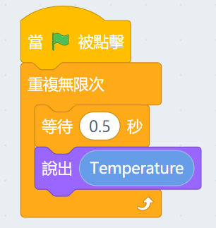

# Meowbit's Temperature Sensor

Meowbit has a built-in Temperature Sensor that allows it to detect the ambient temperature.

## MakeCode Arcade Coding Tutorial

### Load Controller Extension

### [Loading Extensions](../Makecode/powerBrickMC)

### Blocks for Controller Extension

### Detecting the temperature

[Sample Code Link](https://makecode.com/_0RVU8sirC9hM)

##  Kittenblock Coding Tutorial

### Detecting the temperature

