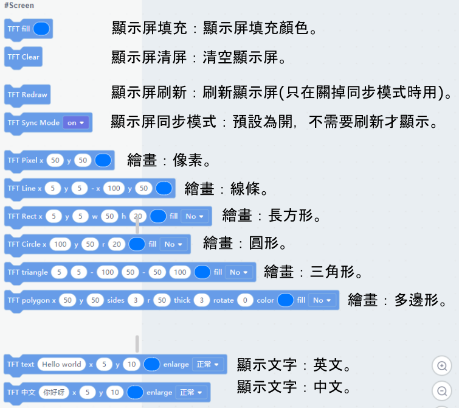
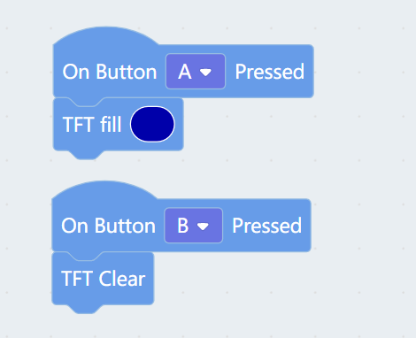
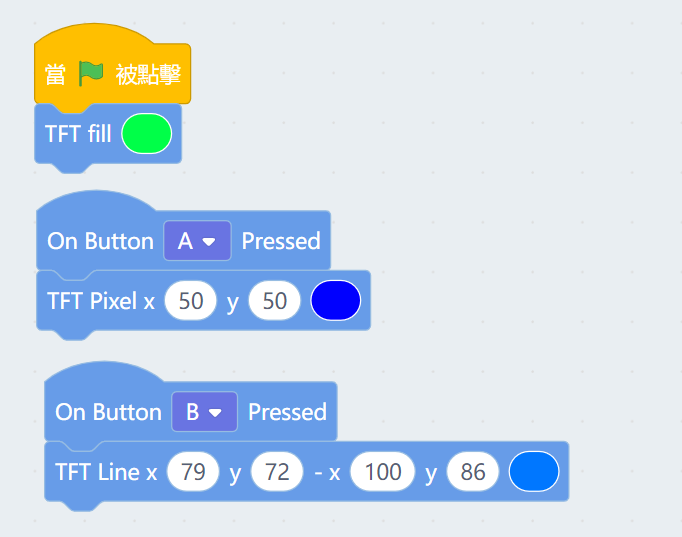
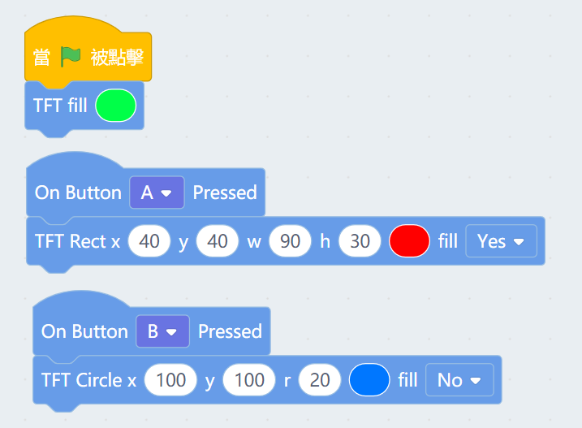
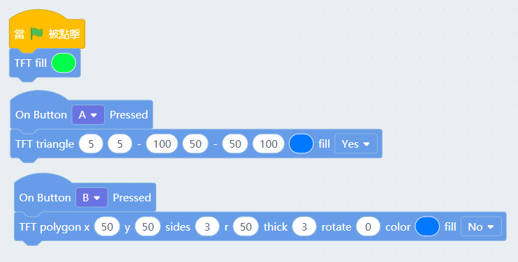
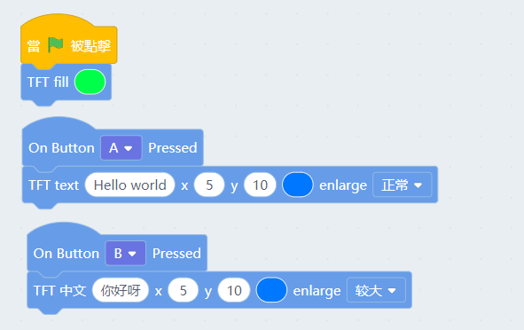

# Meowbit's Display(Kittenblock)

Meowbit's screen can be programmed to display various text or shapes.

##  Kittenblock Coding Tutorial

### Blocks for displaying

### Filling a color and clear screen

### Drawing dots and lines

    Lines must be given two coordinates for them to be drawn.

### Drawing Rectangles and Circles

    The coordinates of a rectangle represents its top-left corner, with width and height as w and h.
    The coordinates of a circle represents its origin, with radius as r.

    
### Drawing Triangles and Polygons

    Give 3 coordinates as vertices to create a triangle.
    The coordinates of a polygon represents its origin.

### Displaying text

    The coordinates are at the top-left corner of the string.
    Traditional Chinese Characters are not supported yet.

