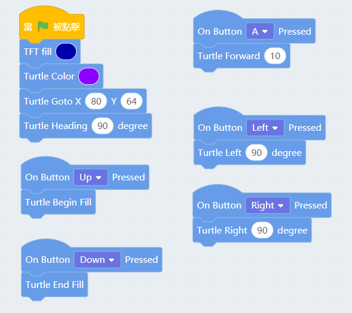
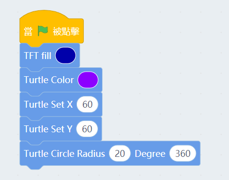
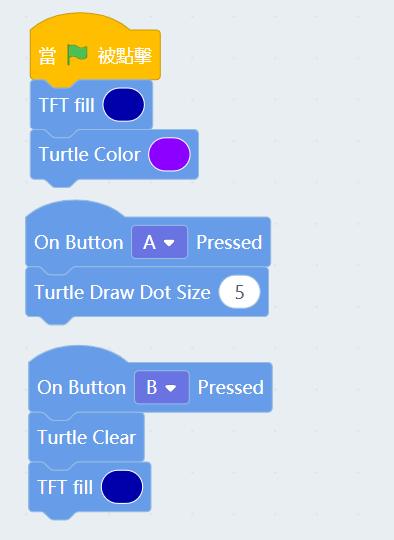
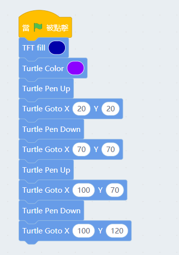

# Meowbit & Turtle(Kittenblock)

Turtle Academy is a programming tool designed for children, Turtle is also available on Meowbit in Kittenblock.

##  Kittenblock Coding Tutorial

### Blocks for controlling Turtle

### Turtle Movements and Filling

Press up to begin filling, press A to go forwards, use Left and Right to turn and press down to complete the filling.

### Setting Coordinates and Drawing Circles

Setting the coordinates and drawing a circle with a radius of 20 pixels.

### Drawing dots and clearing the screen.

    Clearing the screen also clears the background.

### Pen Up and Pen Down

    Any movement of the turtle would draw a line if the pen is down. We can use pen up to avoid this.

Using Pen Up and Pen Down, it can draw 2 serperate lines.

