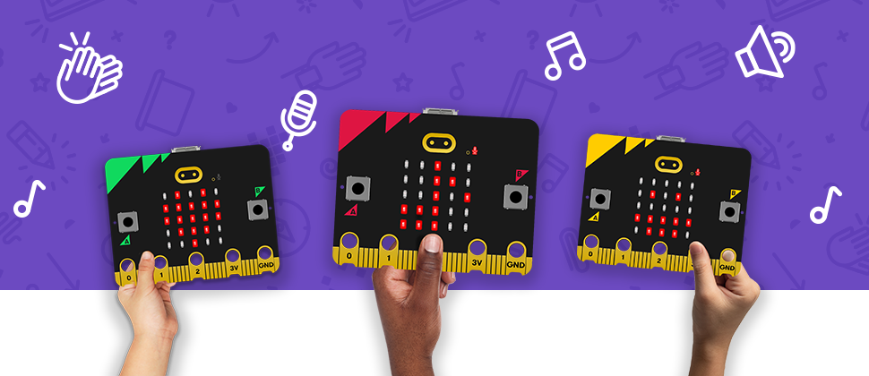
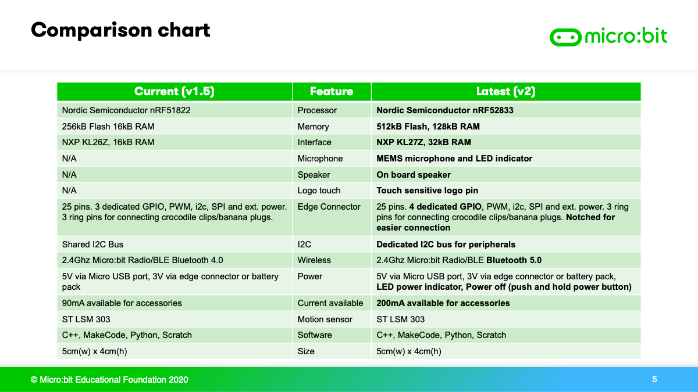

# BBC Micro:bit V2

Since the initial release of BBC Micro:bit in 2016, the long-awaited V2 of the Micro:bit is released in November, 2020!Compared to the first generation, this new Micro:bit has been massively upgraded in both performance and design.

In this article, every detail of the Micro:bit V2 will be covered.

BBC Micro:bit Official Website: <https://microbit.org/new-microbit/>

## Appearnace

(Picture Credit: https://micromag.cc/microbit-v2-announcement/)

## Official Trailer

# Micro:bit Upgrades

Microbit V2 has been upgraded in 6 different areas, let's take a close look at each of them.

## Upgrade 1: Built-in Microphone

Micro:bit V2 has finally added a microphone, allowing it to sense the loudness of a sound.

Using sounds to control the Micro:bit will surely open up even more possibilities for your creations!

(Picture Credit: https://micromag.cc/microbit-v2-announcement/)

The Micro:bit Organization states that it is a must to educate the public about the importance of privacy and surveillance, thus the Microphone icon would light up when it is in use.

(Picture Credit: https://micromag.cc/microbit-v2-announcement/)

The microphone can be easily programmed with these programming blocks.

### Demonstration:

Clappy Hearts: The Micro:bit shows a heart icon when it hears a clap.

Sing your heart out: Sing until the entire matrix is lit up.

## Upgrade 2: Built-in Speaker

Making sounds with a Micro:bit used to require an external buzzer with the first generation, but now with the built-in speaker of the Micro:bit, sounds can finally be made without connecting an external buzzer.

This feature unlocks more potential for your creations, and it gives students more physical feedbacks.

The speaker can be easily programmed using these programming blocks.

### Demonstration:

Bumblebee: Microbit buzzes like a bee.

Parrot: Microbit imitates your voice.

## Upgrade 3: Touch Sensor

On the new Micro:bit, you will find a gold Micro:bit logo. This golden logo is more than just appearance, it is actually a new feature built into the Micro:bit, a touch sensor.

(Picture Credit: https://micromag.cc/microbit-v2-announcement/)

The touch sensor functions just like the A and B buttons.

## Upgrade 6: Standby Mode

In order to cater to education needs, a Standby mode is added to the V2 to allow suspension of Micro:bit's program. Teachers can now suspend and resume a program after they finished teaching.

The Standby mode can be entered by pressing and holding the reset button for a few seconds, the power LED flashes slowly when it is in Standby mode.

In addition, the new Micro:bit draws less power, meaning it can last longer with a battery pack than before.

(Picture Credit: https://micromag.cc/microbit-v2-announcement/)

## Upgrade 5: Performance

In preparation of future functions such as Artificial Intelligence and Machine Learning, the new Micro:bit has a new microchip that has vastly improved processing capabilities. The memory capacity is 8 times of the original, it now has 128Kb of RAM. The ROM has also been increased to 512 KB, allowing more complex and longer programs to be uploaded to the Micro:bit. Connectivity has also been upgraded to support the latest Bluetooth 5.0.

## Upgrade 6: Edge Connectors

The edge connectors has always been a mainstay of the Micro:bit to allow different modules to be used. It has also been given improvements to improve usability.

### 1. Design

A small notch has been added to the major pins of the Micro:bit.

(Picture Credit: https://micromag.cc/microbit-v2-announcement/)

This notch is specially designed to be used with crocodile clips. In the previous generation, the crocodile clips are prone to disconnect as they were not firmly attached to the Micro:bit.

With this new notch design, the clips will have a firmer and more stable connection with the pins.

(Picture Credit: https://micromag.cc/microbit-v2-announcement/)

### 2. I2C Pin Upgrades

The I2C pins is now dedicated rather than shared with other pins, improving compatibility with more I2C modules.

### 3. Power Delivery

The current output of the edge connectors have been upgraded from 90mA to 200mA to allow users to use even more functional modules.

## Microbit V2 Details

(Picture Credit: https://mp.weixin.qq.com/s/u5Sj8DZg6oPHOOfzHbb1PA)

# V1 vs V2

## Compatibility

Of course, with all these upgrades, many users maybe concerned about one issue: compatibility.

#### You may ask: Are my old programs compatible with the new Micro:bit?

#### The answer is YES, but there is one thing to keep in mine.

As the Micro:bit V2 features quite a big change, Microsoft MakeCode has also been updated. The V2 runs on a new universal hex format so your old programs cannot directly work on the V2.

But there is no need to worry, all old hex programs can be converted to the new universal hex format when you upload the hex and download it from MakeCode. This universal hex has a larger file size but it can be used by both V1 and V2 Micro:bits.

## Side to Side Comparisons

# Microbit V2 & Kittenbot Expansion Boards

#### Is the V2 compatible with my existing Kittenbot Expansion Boards?

#### Yes, the V2 is compativle with Kittenbot Expansions, there is no need to purchase new expansion boards.

Microbit V2 & Robotbit：

Microbit V2 & Armourbit：

## Q&A

### 1. Does the price of Micro:bit V2 increase compared to V1?

#### No, the price of Micro:bit V2 will stay the same.

### 2. When will Micro:bit V2 be available?

#### They will be available from November 2020 onwards.

### 3. Will my Micro:bit V1 still be supported?

#### Both V1 and V2 will be continously supported.
