# High Speed DC Motor

High Speed DC Motor

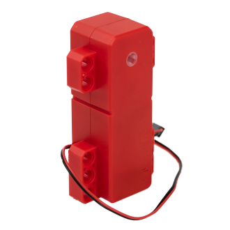

This is a DC motor compatible with Lego technic parts, the speed is 2 times more than the 9g motor. The output axle is also compatible with Lego technic axles. It is suitable for driving robots that require a high speed for example in racing scenarios.

## Specifications

- Operating Voltage: 3.3V~6V
- Rated Voltage: 4.8V
- Rated Current: 200mA
- Blocked Rotor Current: 1800mA   
- Maximum RPM: 200rpm
- Stopping Torque: 1000g
- Weight: 44g
- Connector: Red and Black Motor Connector

## Special Features:

- Uses an axle connector for output:
    - Connect to axles of different lengths to better suit your needs
    
- Dual outputs:
    - Has outputs axles on both sides

- High speed
    - About 3 times the RPM of the GeekServo 9g Motor

- Carbon Brushed Motor
    - Longer Lifespan and Lower Noise

## Dimensions

### In Lego units:

- Length: 10
- Width: 5
- Height: 3
- Output Axle: Technic Axle

### In mm units:

- Length: 72mm
- Width: 39mm
- Height: 23.8mm
- Output Axle: Technic Axle

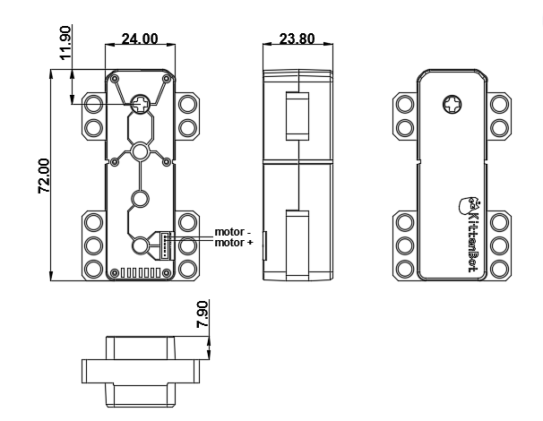

## Connection

In this demonstration, Robotbit is used. It is also possible to use an Armourbit.
    
### Robotbit

---

Connect the cable to the motor.

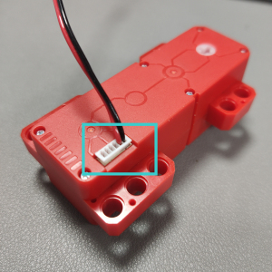

Then connect the motor cable to the motor ports of the Robotbit.

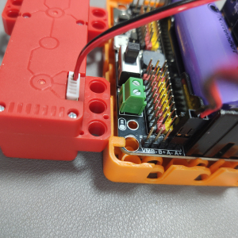

    Reversing the connection would not damage the motor, but the rotational direction will be reversed.
  
## MakeCode Coding Tutorial

### This module can be used by Micro:bit and Meowbit.

--------

### ArmourBit

### Load Powerbrick Extension: https://github.com/KittenBot/pxt-powerbrick

### [Loading Extensions](../Makecode/powerBrickMC)

### Blocks for controlling motors:

## Programming the motors

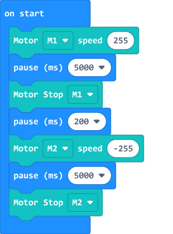

[Sample Code Link](https://makecode.microbit.org/_RYHivyayYL4q)

--------

### RobotBit

### Load Robotbit Extension:

### [Loading Extensions](../Makecode/powerBrickMC)

### Blocks for controlling motors:

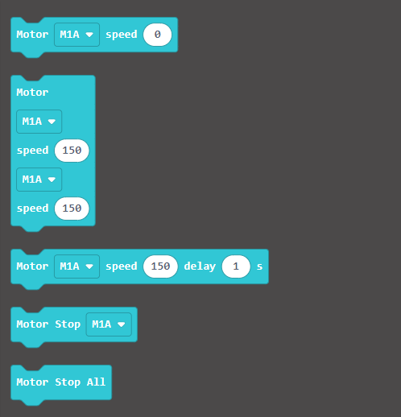

### Programming the motors

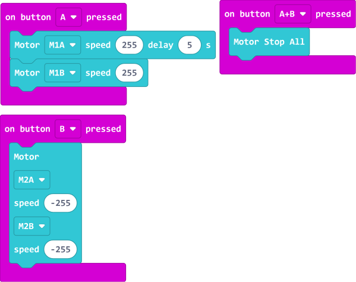

[Sample Code Link](https://makecode.microbit.org/_c8F80i0Ta5cF)

---

### Meowbit:

### Load Robotbit Extension: https://github.com/KittenBot/meow-robotbit

### [Loading Extensions](../Makecode/powerBrickMC)

### Blocks for controlling motors:

### Programming the motors:

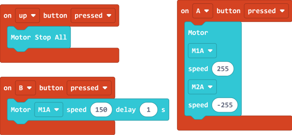

[Sample Code Link](https://makecode.com/_2z0C8v6XAC5y)

## Extension Version and Updates

There may be updates to extensions periodically, please refer to the following link to update/downgrade your extension.

[Makecode Extension Update](../Makecode/makecode_extensionUpdate)

## KittenBlock Coding Tutorial

---

### Armourbit

### Load Powerbrick Extension

Open the hardware menu and select Powerbrick to load the extension for Micro:bit and Powerbrick.

### Blocks for controlling motors:

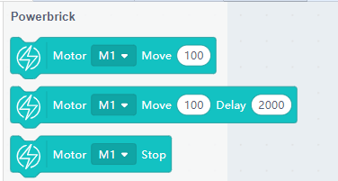

### Programming the motors

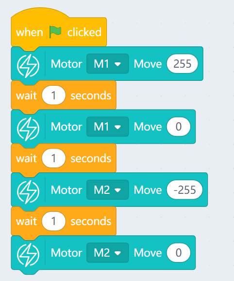

---

### Robotbit

### Load Robotbit Extension

Open the hardware menu and select Micro:bit to load the extension for Micro:bit and Robotbit.

### Blocks for controlling motors:

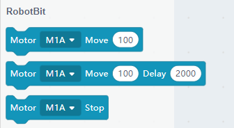

### Programming the motors

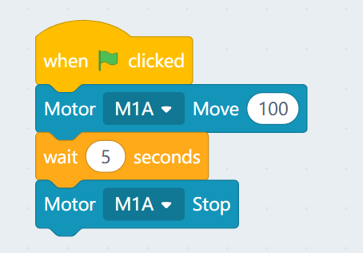

## FAQ

1: The Micro:bit does not react when I click the programming blocks.

Make sure the Micro:bit has been connected to the Kittenblock and then try flashing the firmware.
