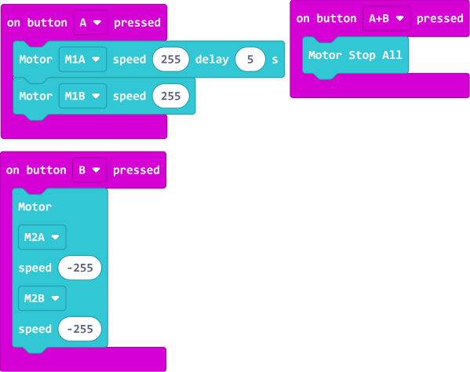
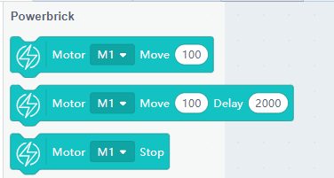

# GeekServo 2KG Motors

2KG Motors (HKBD8009A)

This is a motor compatible with Lego technic parts, compared to 9g motors, it has a higher speed. The output axle is a Lego technic axle connector. It is suitable for applications where a high power driver is required.

## Specifications

- Operating Voltage: 3.3V~6V
- Rated Voltage: 4.8V
- Rated Current: 70mA
- Blocked Motor Current: 900mA   
- Slipping Current: 700mA
- Maximum Torque: 1.6kg±0.2kg/cm(4.8V)
- Maximum Speed: 45rpm(3V)
- Weight: 20g
- Connector: Red and Black Motor Connector

## Special Features

Inherits the special features of the 9g motor while improving torque and speed at the same time.

- Uses an axle connector for output
    - Allows connecting axles of different lengths to better suit your needs
    
- Dual Outputs
    - Output axles are found on both sides

- Larger rotational range
    - Has a full 360° range

- Higher Torque
    - About 3 times the torque of a 9g motor

## Dimensions

### In Lego units:

- Length: 5
- Width: 3
- Height: 3
- Output Axle: Technic Axle

### In mm units:

- Length: 40mm
- Width: 24mm
- Height: 24mm
- Output Axle: Technic Axle

## Connection

### Armourbit

---

Connect the motor to the motor ports on the Armourbit.

    Reversing the connection would not damage the motor, but the rotational direction will be reversed.
     
### Robotbit

---

Connect the motor to the motor ports on the Robotbit.

    Reversing the connection would not damage the motor, but the rotational direction will be reversed.
 
## MakeCode Coding Tutorial

### This module can be used by Micro:bit and Meowbit.

--------

### ArmourBit

### Load Powerbrick Extension: https://github.com/KittenBot/pxt-powerbrick

### [Loading Extensions](../Makecode/powerBrickMC)

### Blocks for controlling motors:

## Programming the motors

[Sample Code Link](https://makecode.microbit.org/_RYHivyayYL4q)

### Makecode Coding Tutorial Video

--------

### RobotBit

### Load Robotbit Extension:

### [Loading Extensions](../Makecode/powerBrickMC)

### Blocks for controlling motors:

### Programming the motors

[Sample Code Link](https://makecode.microbit.org/_c8F80i0Ta5cF)

---

### Meowbit:

### Load Robotbit Extension: https://github.com/KittenBot/meow-robotbit

### [Loading Extensions](../Makecode/powerBrickMC)

### Blocks for controlling motors:

### Programming the motors:

[Sample Code Link](https://makecode.com/_2z0C8v6XAC5y)

## Extension Version and Updates

There may be updates to extensions periodically, please refer to the following link to update/downgrade your extension.

[Makecode Extension Update](../Makecode/makecode_extensionUpdate)

## KittenBlock Coding Tutorial

---

### Armourbit

### Load Powerbrick Extension

Open the hardware menu and select Powerbrick to load the extension for Micro:bit and Powerbrick.

### Blocks for controlling motors:

### Programming the motors

---

### Robotbit

### Load Robotbit Extension

Open the hardware menu and select Micro:bit to load the extension for Micro:bit and Robotbit.

### Blocks for controlling motors:

### Programming the motors

## FAQ

1: The Micro:bit does not react when I click the programming blocks.

Make sure the Micro:bit has been connected to the Kittenblock and then try flashing the firmware.
