# GeekServo 2KG Servo

2KG Servo (HKBD8008A)

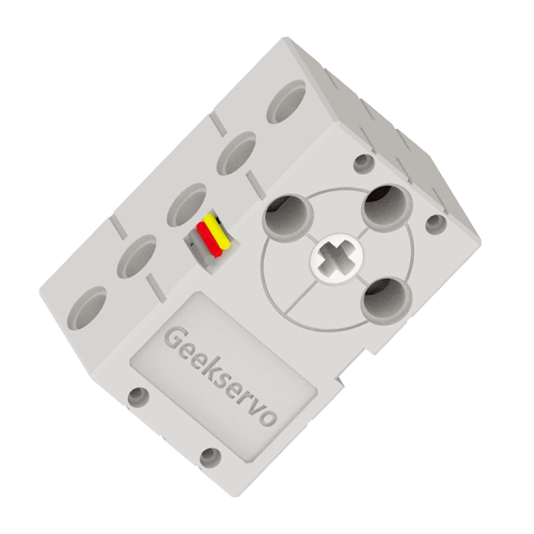

This is a servo compatible with Lego technic parts, compared to 9g Servos, it can produce a higher torque. The output axle is a Lego technic axle connector. It is suitable for applications where a precise control is required.

## Specifications

- Operating Voltage: 3.3V~6V
- Rated Voltage: 4.8V
- Rated Current: 70mA
- Blocked Rotor Current: 900mA   
- Slipping Current: 700mA
- Maximum Torque: 1.6kg±0.2kg/cm(4.8V)
- Rotational Speed: 60°/0.14s
- Rotational Range: 0°~360°
- Weight: 20g
- Connector: Orange-Red-Brown Servo Connector

## Special Features

Inherits the special features of the 9g servo while improving torque and speed at the same time.

- Uses an axle connector for output
    - Allows connecting axles of different lengths to better suit your needs
    
- Dual Outputs
    - Output axles are found on both sides

- Larger rotational range
    - Has a full 360° range

- Higher Torque
    - About 3 times the torque of a 9g servo

## Dimensions

### In Lego units:

- Length: 5
- Width: 3
- Height: 3
- Output Axle: Technic Axle

### In mm units:

- Length: 40mm
- Width: 24mm
- Height: 24mm
- Output Axle: Technic Axle

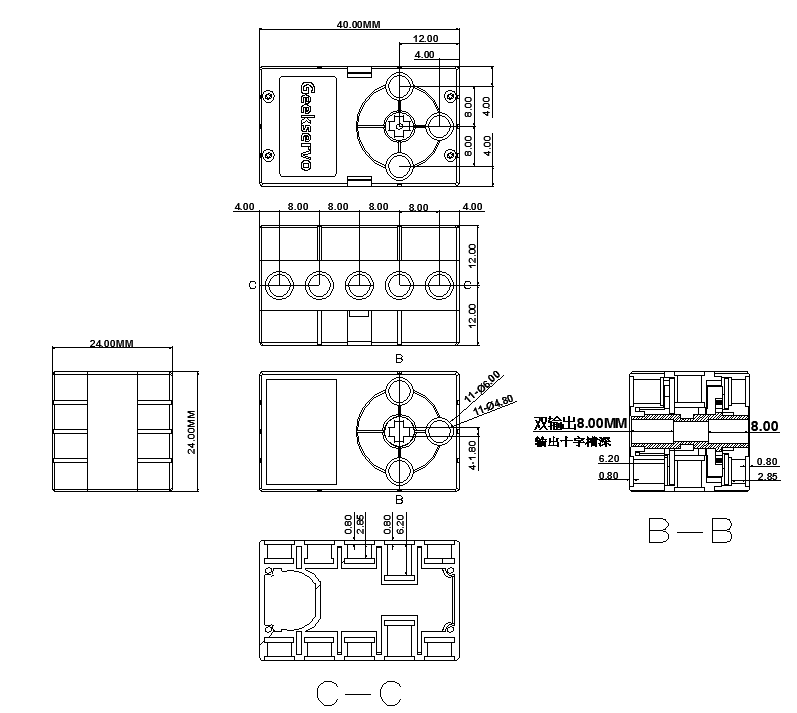

## Connection

### ArmourBit

Connect the servo to the servo ports of the Armourbit.

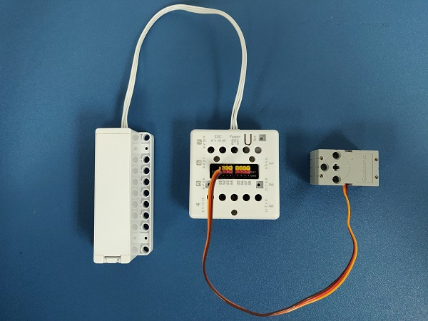

    Orange to Yellow, Red to Red, Brown to Black.
    
### RobotBit

Connect the servo to the servo ports of the Robotbit.

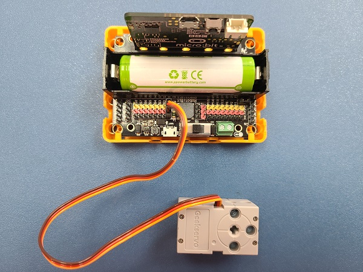

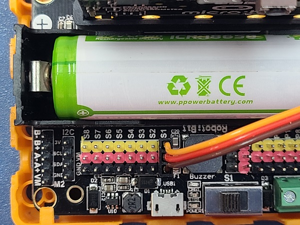

    Orange to Yellow, Red to Red, Brown to Black.
    
## MakeCode Coding Tutorial

### This module can be used by Micro:bit and Meowbit.

### The programming for ArmourBit and Robotbit are identical.

### ArmourBit

---

### Load Powerbrick Extension: https://github.com/KittenBot/pxt-powerbrick

### [Loading Extension](../Makecode/powerBrickMC)

### RobotBit

---

### Load Robotbit Extension:

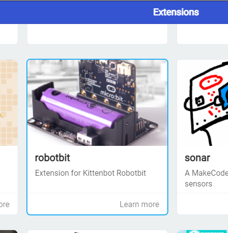

---

### Blocks for controlling servos:

### Programming the servos

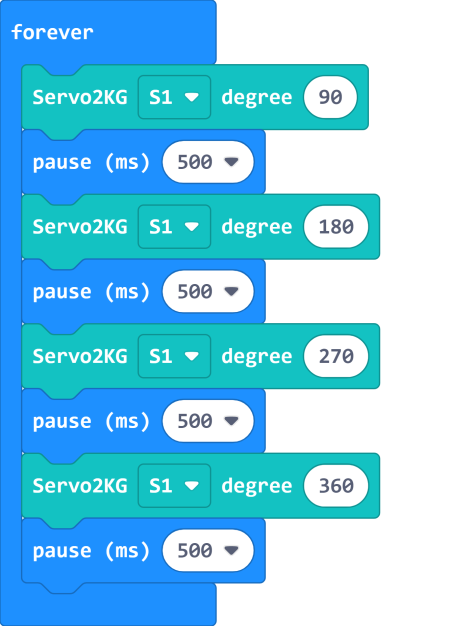

[Sample Code Link](https://makecode.microbit.org/_Fxq45rHFrD8s)

### Meowbit:

---

### Load Robotbit Extension: https://github.com/KittenBot/meow-robotbit

### [Loading Extensions](../Makecode/powerBrickMC)

### Blocks for controlling motors:

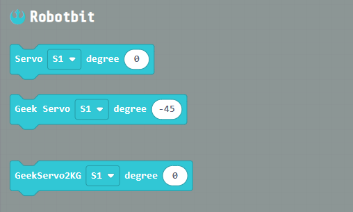

## Programming the motors

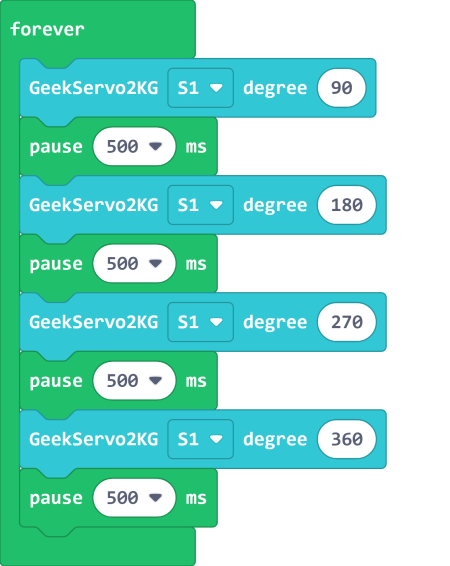

[Sample Code Link](https://makecode.com/_2syJW2iFPUMx)

## Extension Version and Updates

There may be updates to extensions periodically, please refer to the following link to update/downgrade your extension.

[Makecode Extension Update](../Makecode/makecode_extensionUpdate)

## KittenBlock Coding Tutorial

---

### Armourbit

### Load Powerbrick extension

Select Powerbrick from the Hardware Menu.

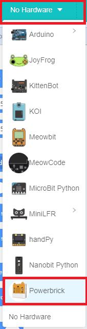

### Blocks for controlling servos:

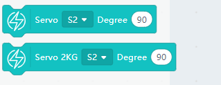

### Programming the servos:

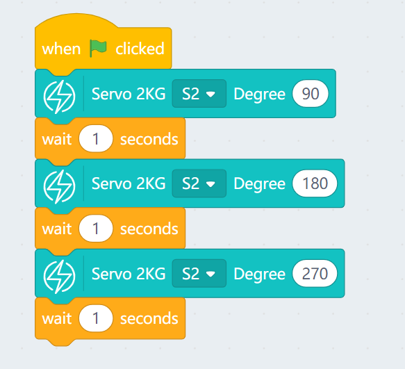

---

### Robotbit

### Load Robotbit Extension

Open the hardware menu and select Micro:bit to load the extension for Micro:bit and Robotbit.

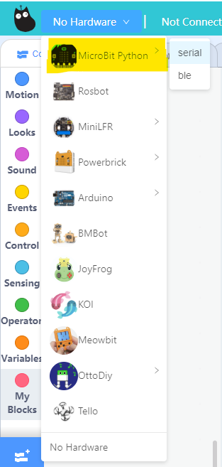

### Blocks for controlling servos:

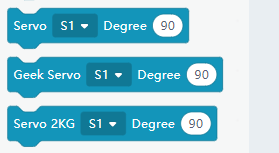

### Programming the servos

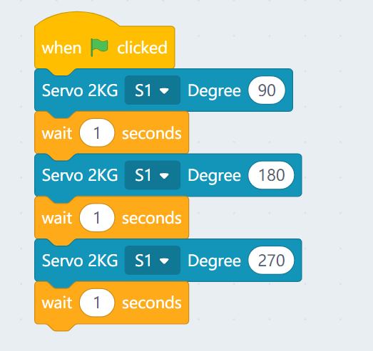

## FAQ

1: The Micro:bit does not react when I click the programming blocks.

Make sure the Micro:bit has been connected to the Kittenblock and then try flashing the firmware.
