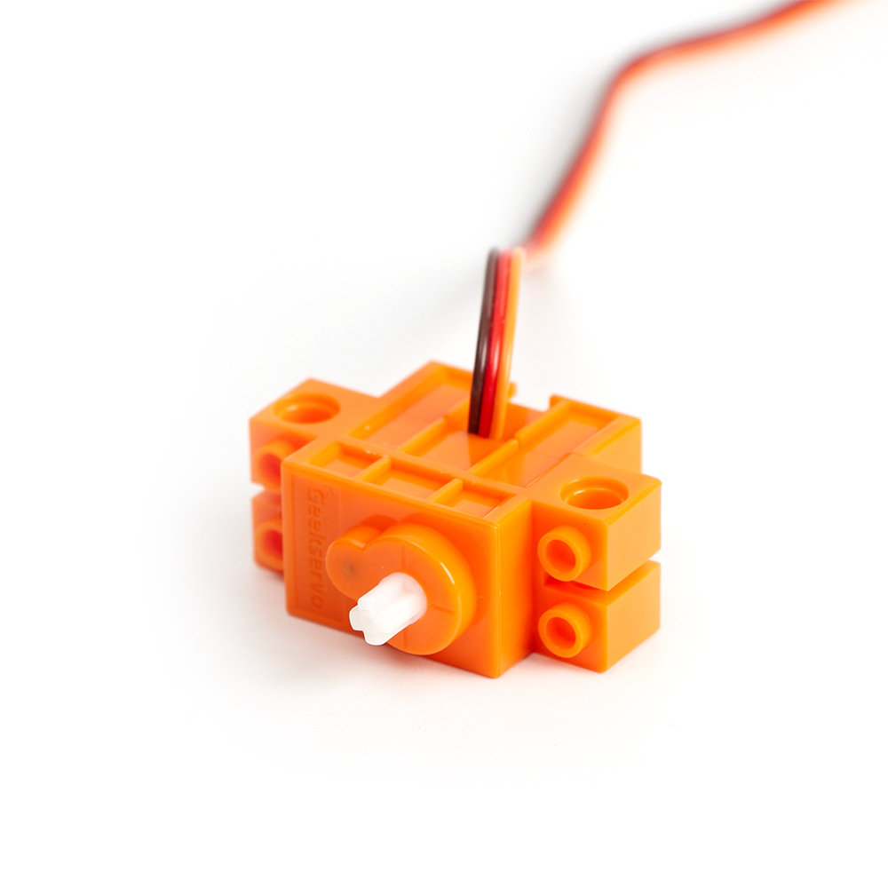
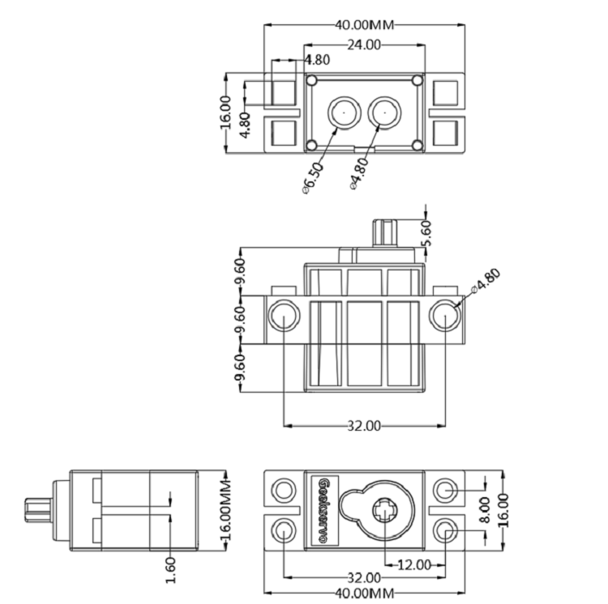
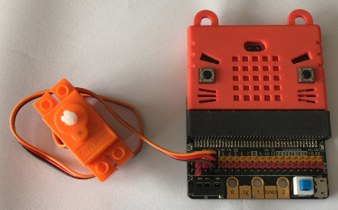
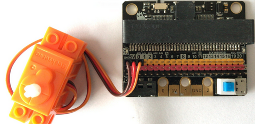
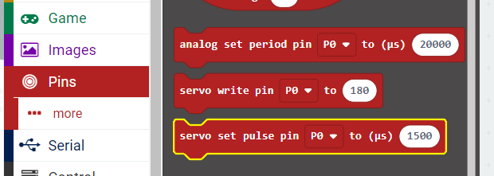
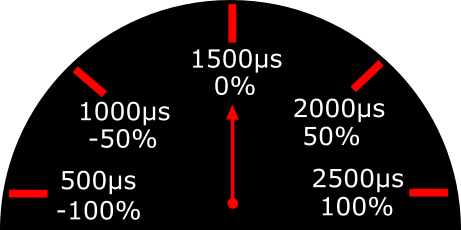
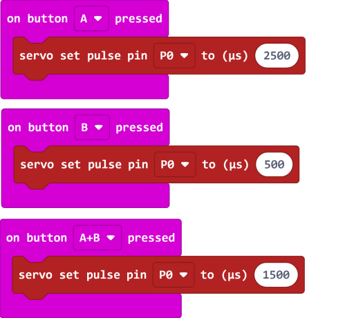
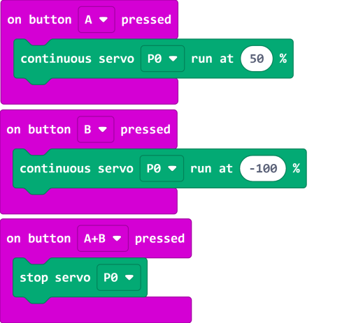
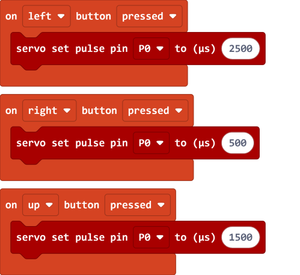

# Geek Motor O 360 Servo

Geek Motor O 360 Servo(HKBD8001A)

This is a small continuos servo compatible with Lego technic parts, the output axle is compatible with Lego technic axles. It is mainly used to drive wheels or gears.

This is a special servo because it can be used as a motor for boards that lack a motor drivers, for example IOBit. They can be controlled simply with IO pins.

## Specifications

- Operating Voltage: 3.3V~6V
- Rated Voltage: 4.8V
- Rated Current: 200ma
- Blocked Rotor Current: 700ma
- Slipping Current: 450ma
- Maximum torque: 500g/cm(4.8V)
- Maximum RPM: 70rpm
- Weight: 12.4g
- Connector:  Orange-Red-Brown Servo Connector

## Geekservo Features

- Clutch Protection:
    - In case of violent turning of the output axle, the clutch is enabled to protect the gears from damage.

- Flexible Installation:
    - Can be mounted on standard Lego bricks or with Technic elements, providing a lot of possibilities for installation.

- Small and lightweight:
    - Suitable for small robotic projects.
    
- Does not require motor driver:
    - Suitable for expansion boards that lack a motor driver.
    
## Dimensions:

### In Lego units:

- Length: 5
- Width: 2
- Height: 3
- Output axle: Technic Axle

### In mm units:

- Length: 40mm
- Width: 16mm
- Height: 34.4mm
- Output axle: Technic Axle

    
## Connection

### IOBit

Connect the servo to an **Analog Pin** of the IOBit.

    Both 3V and 5V are supported.
    Orange to Yellow, Red to Red, Brown to Black.  
    

## MakeCode Coding Tutorial

### This module can be used by Micro:bit and Meowbit.

## Programming the servo(Method 1)

The servo can be controlled with the pulse block.

The pulse value for this servo is from 500 to 2500.

    500 means full speed backwards, 2500 means full speed forwards, 1500 means full stop.

[Sample Code Link](https://makecode.microbit.org/_Ub76W98a29A2)

## Programming the servo(Method 2)

### Load the servo extension

### [Loading Extensions](../Makecode/powerBrickMC)

[Sample Code Link](https://makecode.microbit.org/_JdJDbv5ue97t)

### Meowbit:

---

### Load the Robotbit extension: https://github.com/KittenBot/meow-robotbit

## Programming the servo

[Sample Code Link](https://makecode.com/_DPeAM8h5HMaf)